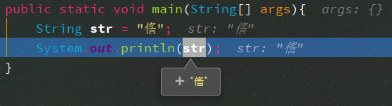

[TOC]

---
---

## 编码（字符集）与编码格式

编码（字符集）是字符与二进制代码一一对应的关系 可以理解为一个字典

GBK GB2312 Unicode等是编码

UTF-8 UTF-16 是Unicode编码的实现格式

### Unicode编码

Unicode 只是一个字符集，它只规定了符号的二进制代码，却没有规定这个二进制代码应该如何存储

    比如，汉字严的 Unicode 是十六进制数4E25，转换成二进制数足足有15位（100111000100101），也就是说，这个符号的表示至少需要2个字节。表示其他更大的符号，可能需要3个字节或者4个字节，甚至更多
    Unicode没有规定编码的存储方式 对于英文字符用3或4个字节表示过于浪费 故衍生出了UTF-8等Unicode的编码格式
*GBK编码的编码格式就是GBK*

#### UTF-8
> UTF-8 是一种变长的编码方式。它可以使用1~4个字节表示一个符号，根据不同的符号而变化字节长度
> UTF-8 的编码规则
>
> 1. 对于单字节的符号，字节的第一位设为0，后面7位为这个符号的 Unicode 码。因此对于英语字母，UTF-8 编码和 ASCII 码是相同的
> 2. 对于n字节的符号（n > 1），第一个字节的前n位都设为1，第n + 1位设为0，后面字节的前两位一律设为10。剩下的没有提及的二进制位，全部为这个符号的 Unicode 码

## Java中`String`编码

Java中`String`在程序运行中时即在内存中时**均为Unicode编码**

### 深入理解`String.getBytes()`

​    由于在Java中`String`一直是Unicode的编码故在数据传输时需要将其以指定编码格式转为字节数组以使字符串能正确的持久化[^1] (被写入文件或在网络上传输)
​    绝大部分的乱码问题都是因为字符串的编码[^2]解码[^3]出问题了

在Java中`getBytes`有三个重载的方法 分别是:
1. `getBytes()` 使用默认的字符集编码[^2] 默认字符集在Java中可用`System.getProperty("file.encoding")`或`Charset.defaultCharset()` 在中文系统中一般是*GBK*
2. `getBytes(Charset charset)` 使用给定的charset将该String编码[^2]为字节序列，将结果存储到新的字节数组中
3. `getBytes(String charsetName)` 使用命名的字符集将此 String编码[^2]为字节序列，将结果存储到新的字节数组中

*已弃用的不在此说明*

代码示例
```java
public static void main(String[] args) throws UnsupportedEncodingException {
    String string = "码农爱撸猫";
    // 1
    printBytes(string.getBytes());
    // 2
    printBytes(string.getBytes("GBK"));
    // 3
    printBytes(string.getBytes(StandardCharsets.UTF_8));
}
private static void printBytes(byte[] bytes){
    System.out.println();
    for (byte bt : bytes){
        System.out.print("["+bt+"]");
    }
    System.out.println();
}
// 输出如下
/*
// 1
[-25][-96][-127][-27][-122][-100][-25][-120][-79][-26][-110][-72][-25][-116][-85]
// 2 使用GBK能够获取到正确的编码说明 String 一直是Unicode编码
[-62][-21][-59][-87][-80][-82][-33][-93][-61][-88]
// 3 和 1 的输出一致说明当前默认字符集是UTF-8
[-25][-96][-127][-27][-122][-100][-25][-120][-79][-26][-110][-72][-25][-116][-85]
*/
```

### 深入理解String由byte[]构建的构造函数

1. `String(byte[] bytes)`
通过使用平台的默认字符集解码指定的字节数组来构造新的 String
2. `String(byte[] bytes, Charset charset)`
构造一个新的String由指定用指定的字节的数组解码charset
3. `String(byte[] bytes, String charsetName)`
构造一个新的String由指定用指定的字节的数组解码charset

​    实际应用中经常有这样的需求将指定编码格式的字符串转为另一种编码格式字符串,接到需求后马上打开百度搜索`Java 字符串编码转换`
​    比如 要求将GBK编码的字符串转为UTF-8编码的字符串 网络上流行的解决 如下
~~`String newStr = new String(oldStr.getBytes("GBK"),"UTF-8");`~~ 这段代码的实际意思是将`oldStr`以GBK编码格式编码得到GBK编码格式的字节数组,然后以UTF-8的编码格式解码成字符串

```java
public class CharestTrain3 {
    // 编码转换测试
    public static void main(String[] args) throws IOException {
        String content = "码农爱撸猫";
        String pathGBK = "c:/temp/testGBK.txt";
        String pathUTF = "c:/temp/testUTF.txt";
        String encodingUTF = "UTF-8";
        String encodingGBK = "GBK";
        // 使用GBK编码将原始内容写入文件
        write(pathGBK, content, encodingGBK);
        // 读取GBK编码文件
        String gbkStr = read(pathGBK, encodingGBK);
        // 输出GBK编码文件字符串
        System.out.println("gbkStr:"+gbkStr);
        // 将GBK编码文件(testGBK.txt)内容以UTF-8编码写入文件(testUTF.txt)
        write(pathUTF, gbkStr, encodingUTF);
        // 读取UTF编码文件
        String utfStr = read(pathUTF, encodingUTF);
        // 输出UTF编码文件字符串
        System.out.println("utfStr:"+utfStr);
    }
    // 读文件
    private static String read(String path, String encoding) throws IOException {
        StringBuilder content = new StringBuilder();
        File file = new File(path);
        BufferedReader reader = new BufferedReader(new InputStreamReader(new FileInputStream(file), encoding));
        String line;
        while ((line = reader.readLine()) != null) {
            content.append(line).append("\n");
        }
        reader.close();
        return content.toString();
    }
    // 写文件
    private static void write(String path, String content, String encoding) throws IOException {
        File file = new File(path);
        if (file.delete()){
            file.createNewFile();
        }
        BufferedWriter writer = new BufferedWriter(new OutputStreamWriter(new FileOutputStream(file), encoding));
        writer.write(content);
        writer.close();
    }
}
// 输出
/*
gbkStr:码农爱撸猫
utfStr:码农爱撸猫
*/
```

### System.out.print(x) 输出乱码

在运行以下代码时 加入如下命令`-Dfile.encoding=GBK`可以看到输出是乱码 因为汉字**㑾**在GBK字符集中没有对应的编码 导致在调试时可以看到汉字**㑾**能正确显示 但在console的输出中乱码, 当你在运行时加入`-Dfile.encoding=UTF-8`则调试与输出都能正常显示 由此可知`System.out.print()`在输出字符时使用了运行时的字符集输出了字符
```java
 public static void main(String[] args){
    String str = "㑾";
    System.out.println(str);
}
// 输出
// ?
```


## CXF WebService框架

参数字符串 持久化传输时使用的UTF-8编码

---
---

[^1]: 持久化:数据持久化就是将内存中的数据模型转换为存储模型,以及将存储模型转换为内存中的数据模型的统称.数据模型可以是任何数据结构或对象模型,存储模型可以是关系模型、XML、二进制流等 [数据持久化百度百科点击此处](https://baike.baidu.com/item/%E6%95%B0%E6%8D%AE%E6%8C%81%E4%B9%85%E5%8C%96	"数据持久化")

[^2]: 编码:将字符串转为指定编码格式的字节数组

[^3]: 解码:将字节数组以指定编码格式转为字符串