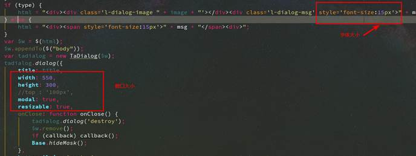
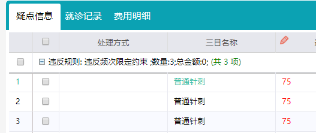

# openwindow 默认最大化

```javascript
/**
 * 打开窗口
 * @method openWindow
 * @param {String} id 窗口id
 * @param {String} title 窗口标题
 * @param {String} url aciton地址
 * @param {map} parameter 入参 json格式对象，例如:{"dto['aac001']":"1000001","dto['aac002']":"01"}
 * @param {Number} width 宽度 不要加 px；也可设置成百分比，例如"80%"
 * @param {Number} height 高度 不要加 px；也可设置成百分比，例如"80%"
 * @param {Function} onLoad 窗口加载完毕回调，如果useIframe=true的话 这参数不起作用
 * @param {Funciton} onClose 窗口关闭的时候回调
 * @param {Boolean} useIframe 是否使用iframe的方式加载，默认为false，iframe方式会存在seesion丢失，应当避免;为true的时候，打开页面为一个完整的jsp页面
 * @param {String} style 自定义打开窗口css样式
 * @param {Object} myoptions window的创建参数
 */
function openWindow(id, title, url, parameter, width, height, onLoad, onClose, useIframe, style, myoptions)

// 设置最大化 myoptions参数 {maximized:true}
// 最小化：{minimized:true}

```

# 修改alert框字体 以及 框尺寸

ta3Cloud.js 5394行



# 公用部分（菜单点击区域 退出区域等）与功能部分jsp代码交换数据

父页面(html1)可以通过getElementById("ifram1").contentWindow获取子页面的window对象；

子页面可以通过window.parent获取父页面的window对象。

如 下面的代码 获取到公共的IndexTabCsi 实现页面点击按钮跳转到其他功能

```js
window.parent.IndexTabCsi.addTab(
  '110657',// 菜单id
  'demo',// 菜单名称
  'medplatform/common/codeTableManager.do',// controller url
  function() {
      return true;
  });
```

# boxComponent使用

jsp部分示例

```html
<ta:boxComponent id="ka20" key="三目名称" height="200px" width="500px" arrowPosition="vertical">
    <ta:datagrid id="ka20dg" columnFilter="true" onRowDBClick="ka20ClickCbk" fit="true">
    <ta:datagridItem id="ake001" key="三目编码" width="100"/>
    <ta:datagridItem id="ake002" key="三目名称" width="200"/>
    <ta:datagridItem id="smydsl" key="疑点数" width="100"/>
    <ta:datagridItem id="cpe015" key="涉及金额" width="100"/>
  </ta:datagrid>
</ta:boxComponent>
```

js中 按钮的click或其他事件触发显示

```js
// 三目 聚焦事件 显示 ka20 BoxComponent

  function showKa20(){
      var target=event.srcElement?event.srcElement:event.target;
      Base.showBoxComponent("ka20",target);
      var param={"dto['ake002']":Base.getValue("ake002")};
      Base.submit(null,"injuryAppealController!queryKa20.do",param);
  }
```

# dataGrid

## dataGridItem的formatter属性

对列进行渲染时使用此属性

必须return 此单元格的值 如果不是对值进行修改 直接return value;

#### 实现类似合并单元格的效果

```js
/**
 * 身份证号列渲染
 * @param row 行号 
 * @param cell 列号 
 * @param value 值 此单元格的值
 * @param columnDef 该列属性信息
	只能修改 dataGridItem有的属性 没有的属性如style则不能修改
	例如 columnDef.dataAlign=”center”;
 * @param dataContext 当前行数据 
	例如 var aac003 = dataContext.aac003
 */
function fnIdCardQNFormatter(row, cell, value, columnDef, dataContext) {
// 获取dataGrid对象
    var dgQN = Base.getObj(dataGridNameXXQN);
    var aac002Current = dataContext.aac002;
    if(row > 0){
        var aac002Previous = dgQN.getDataItem(row-1).aac002;
        if(aac002Previous != aac002Current){
            return aac002Current;
        }else {
            return "";
        }
    }else {
        return aac002Current;
    }
}

```

#### 对值进行渲染

对整个单元格进行渲染 需要使用css选择器进行操作 参考[前台框架不支持采用原生或其他框架记录.md](./前台框架不支持采用原生或其他框架记录.md "点我跳转")

```js
// 对值进行渲染
function *fnFormatXQ*(row,cell,value,columnDef,dataContext) {
   return "<a style='background-color: red' class='name'>"+value+"</a>";
 }
```

## groupingBy属性

在前台表格分组 groupingBy="要分组的列id"



# fit方法修改（所有Ta组件fit属性的实现方法）

方法名fitForm

## 修正页面被tabs填充时会有滚动条的问题

ta3Cloud.js 7315行修改如下

`$this.height(h - getComputedParam($this, 'paddingTop') - getComputedParam($this, 'paddingBottom') - 6 - 5);`


# SelectInput
## setSelectInputList
`[{id:'', name: '', px: ''}]`


 