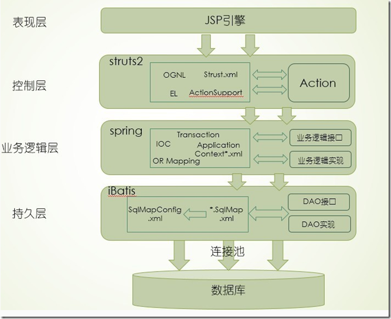

</p>

# SSI框架学习小结

## SSI框架是什么？

Spring

Struts

Ibatis（现更名Mybatis）

> Java SSI 为 Struts+Spring+Ibatis的一个集成框架，也是目前较流行的一种Web应用程序开源框架。

## Struts2

Struts2主要来源于webwork框架，与Struts1相比，在数据传递方面，Struts2提供了更加强大OGNL标签
功能，使其能够通过在action中定义变量来直接与jsp页面中的数据进行相互传值，省去了Struts1中的formbean；
而在跳转控制方面，Struts2简化了配置文件的信息量，使页面和action之间的交换更加的简洁和直观，
便于开发人员的管理。

## Spring

Spring功能非常的强大，比如它的控制反转/依赖注入机制，省去了我们自己书写工厂模式的工作，
实现类对我们将要用到控制类、业务逻辑类、数据访问类、以及JNDI或者JDBC数据源的托管；Spring
对AOP支持使我们在用户chmod.html' target='_blank'>权限控制、事务处理方面节省了很多工作量；

## iBatis

iBatis则是一种轻量级的OR Mapping框架，与Hibernate相比，iBatis提供了半自动化对象关系 映射的实现，
开发人员需要编写具体的sql语句，为系统设计提供了更大的自由空间，为sql语句优化提供了便利。

## SSI框架结构图
如下所示：



## 与servlet的区别

三大框架实际上做的还是servlet的功能

只不过三大框架将servlet分解开 方便大型项目的开发

Struts（action.java）代替servlet与jsp页面的交互

iBatis（sqlmap.xml）代替了servlet中的sql语句

Spring 将框架结合

## Struts action

jsp页面标签通过对url属性赋值action java方法的路径 达到与jsp交互的过程

### action获取request、response或session等对象 应该怎么做？

这里的`execute`不像`Struts1.x`的那样在参数中引入

开发Web应用程序当然免不了跟这些对象打交道

在`Strutx 2.0`你可以有两种方式获得这些对象：

非`IoC`（控制反转`Inversion of Control`）方式和`IoC`方式。

1. 非`IoC`方式

要获得上述对象，关键Struts 2.0中`com.opensymphony.xwork2.ActionContext`类。

我们可以通过它的静态方法`getContext()`获取当前`Action`的上下文对象。 

另外，`org.apache.struts2.ServletActionContext`作为辅助类`（Helper Class）`，可以帮助您快捷地获得这几个对象。

`HttpServletRequest request = ServletActionContext.getRequest();`
`HttpServletResponse response = ServletActionContext.getResponse();`
`HttpSession session = request.getSession();`
如果你只是想访问`session`的属性`（Attribute）`，你也可以通过`ActionContext.getContext().getSession()`获取或添加`session`范围`（Scoped）`的对象。

2. `IoC`方式

要使用IoC方式，我们首先要告诉IoC容器（Container）想取得某个对象的意愿，通过实现相应的接口做到这点。具体实现，请参考 例 `IocServlet.java`

classes/tutorial/NonIoCServlet.java
```java
package tutorial;

import javax.servlet.http.HttpServletRequest;
import javax.servlet.http.HttpServletResponse;
import javax.servlet.http.HttpSession;

import org.apache.struts2.ServletActionContext;

import com.opensymphony.xwork2.ActionContext;
import com.opensymphony.xwork2.ActionSupport;

publicclass NonIoCServlet extends ActionSupport {
    private String message;
    
    public String getMessage() {
        return message;        
    }
    
    @Override
    public String execute() {    
        ActionContext.getContext().getSession().put("msg", "Hello World from Session!");
        
        HttpServletRequest request = ServletActionContext.getRequest();
        HttpServletResponse response = ServletActionContext.getResponse();        
        HttpSession session = request.getSession();
        
        StringBuffer sb =new StringBuffer("Message from request: ");
        sb.append(request.getParameter("msg"));
        sb.append("<br>Response Buffer Size: ");
        sb.append(response.getBufferSize());
        sb.append("<br>Session ID: ");
        sb.append(session.getId());
        
        message = sb.toString();
        return SUCCESS;
    }
}
```

`classes/tutorial/IoCServlet.java`

```java
package tutorial;

import java.util.Map;

import javax.servlet.http.HttpServletRequest;
import javax.servlet.http.HttpServletResponse;
import javax.servlet.http.HttpSession;

import org.apache.struts2.interceptor.ServletRequestAware;
import org.apache.struts2.interceptor.ServletResponseAware;
import org.apache.struts2.interceptor.SessionAware;

import com.opensymphony.xwork2.ActionContext;
import com.opensymphony.xwork2.ActionSupport;

public class IoCServlet extends ActionSupport implements SessionAware, ServletRequestAware, ServletResponseAware {
    private String message;
    private Map att;
    private HttpServletRequest request;
    private HttpServletResponse response;    
    
    public String getMessage() {
        return message;        
    }
    
    public void setSession(Map att) {
        this.att = att;
    }
    
    public void setServletRequest(HttpServletRequest request) {
        this.request = request;
    }
    
    public void setServletResponse(HttpServletResponse response) {
        this.response = response;
    }
    
    @Override
    public String execute() {        
        att.put("msg", "Hello World from Session!");
        
        HttpSession session = request.getSession();
        
        StringBuffer sb =new StringBuffer("Message from request: ");
        sb.append(request.getParameter("msg"));
        sb.append("<br>Response Buffer Size: ");
        sb.append(response.getBufferSize());
        sb.append("<br>Session ID: ");
        sb.append(session.getId());
        
        message = sb.toString();
        return SUCCESS;
    }
}
```

Servlet.jsp

```html
<%@ page contentType="text/html; charset=UTF-8" %>
<%@ taglib prefix="s" uri="/struts-tags"%>
<html>
<head>
    <title>Hello World!</title>
</head>
<body>
    <h2>
        <s:property value="message" escape="false"/>
        <br>Message from session: <s:property value="#session.msg"/>
    </h2>
</body>
</html>
```

`classes/struts.xml`中`NonIocServlet`和`IoCServlet Action`的配置

```xml
<action name="NonIoCServlet" class="tutorial.NonIoCServlet">
    <result>/Servlet.jsp</result>
</action>
<action name="IoCServlet" class="tutorial.IoCServlet">
    <result>/Servlet.jsp</result>
</action>
```