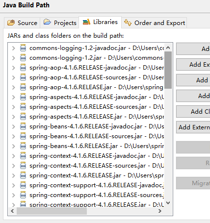

</p>

# 简单Spring项目理解Spring的依赖注入

项目结构图如下：


依赖jar包：


**HelloWorld.java**
```java
package com.tutorialspoint;
public class HelloWorld {
   private String message;
   public void setMessage(String message){
      this.message  = message;
   }
   /*
   public void setMessage(String message,String msg){

   }
   public void setmessage(String message){
          this.message  = message;//运行正常
   }
   // spring 的依赖注入会查找 setXXX(class<?> XXX)方法，
   // XXX是bean中name的值 不区分大小写 
   // 参数名不影响结果
   public void setMessage(String msg){
      this.message  = msg;//运行正常
   }
   */
   public void getMessage(){
      System.out.println("Your Message : " + message);
   }
}
```
**MainApp.java**
```java
package com.tutorialspoint;
import org.springframework.context.ApplicationContext;
import org.springframework.context.support.ClassPathXmlApplicationContext;
public class MainApp {
   @SuppressWarnings("resource")
public static void main(String[] args) {
      // 引入Beans.xml的context
      ApplicationContext context = new ClassPathXmlApplicationContext("Beans.xml");
      // 获取id为"helloWorld"的bean 转化为HelloWorld对象
      // 依赖注入思想  没有new的过程 ，实际是由spring框架new对象
      obj.getMessage();
   }
}
```
**Beans.xml**
```xml
<?xml version="1.0" encoding="UTF-8"?>

<beans xmlns="http://www.springframework.org/schema/beans"
    xmlns:xsi="http://www.w3.org/2001/XMLSchema-instance"
    xsi:schemaLocation="http://www.springframework.org/schema/beans
    http://www.springframework.org/schema/beans/spring-beans-3.0.xsd">

   <bean id="helloWorld" class="com.tutorialspoint.HelloWorld">
       <!-- 为 com.tutorialspoint.HelloWorld 的 message 成员变量赋值 -->
       <property name="message" value="Hello World!"/>
   </bean>
</beans>
```