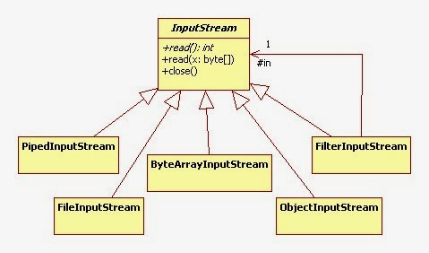

</p>

**转载自http://www.importnew.com/11537.html**

InputStream和Reader都是抽象类，并不直接地从文件或者套接字（socket）中读取数据。然而，它们之间的主要差别在于：InputStream用于读取二进制数据（字节流方式，译者注），Reader用于读取文本数据（字符流方式，译者注），准确地说，Unicode字符。那么，二进制数据和文本数据的区别是什么呢？当然，所有读取的东西本质上是字节，然后需要一套字符编码方案，把字节转换成文本。Reader类使用字符编码来解码字节，并返回字符给调用者。Reader类要么使用运行Java程序平台的默认字符编码，要么使用Charset对象或者String类型的字符编码名称，如“UTF-8”。尽管它是一个最简单的概念，当读取文本文件或从套接字中读取文本数据时，很多Java开发者会因没有指定字符编码而犯错。记住，如果你没有指定正确的编码，或者你的程序没有使用的协议中已存在的字符编码，如HTML的 “Content-Type（内容类型）”、XML文件头指定的编码，你可能无法正确地读取的所有数据。一些不是默认编码呈现的字符，可能变成“？”或小方格。一旦你知道stream和reader之间的根本区别，理解FileInputStream和FileReader之间的差异就很容易了。既可以让你从文件中读取数据，然而FileInputStream用于读取二进制数据，FileReader用来读取字符数据。

## Java中FileReader vs FileInputStream
由于FileReader类继承了InputStreamReader类，使用的字符编码，要么由类提供，要么是平台默认的字符编码。请记住，InputStreamReader会缓存的字符编码。创建对象后，设置字符编码将不会有任何影响。让我们来看看如何使用Java中InputStream和FileReader的例子。你可以提供任何一个文件对象或一个包含文件位置的字符串，以开始读取文件的字符数据。这类似于FileInputStream，也提供了类似的用于读取文件源的构造函数。尽管建议使用BufferedReader来读取文件数据。

```java
import java.awt.Color;
import java.io.FileInputStream;
import java.io.FileReader;
import java.io.IOException;
 
/**
 * Java程序通过字节流和字符流的方式来读取文件数据。
 * 需强调FileInputStream和FileReader的关键区别在于：FileReader用于读取字符流，而FileInputStream用来读取原始字节流。
 * @author Javin Paul
 */
public class HowToReadFileInJava {
    public static void main(String args[]) {
 
        // 例1 – 使用FileInputStream 读取文件内容
        try (FileInputStream fis = new FileInputStream("data.txt")) {
            int data = fis.read();
            while (data != -1) {
                System.out.print(Integer.toHexString(data));
                data = fis.read();
            }
        } catch (IOException e) {
            System.out.println("Failed to read binary data from File");
            e.printStackTrace();
        }
 
        // 例2 – Java中使用FileReader 读取文件数据
        try (FileReader reader = new FileReader("data.txt")) {
            int character = reader.read();
            while (character != -1) {
                System.out.print((char) character);
                character = reader.read();
            }
        } catch (IOException io) {
            System.out.println("Failed to read character data from File");
            io.printStackTrace();
        }
    }
}
```

**输出**

```bash
4157532d416d617a6f6e205765622053657276696365da474f4f472d476f6f676c65da4150504c2d4170706c65da47532d476f6c646d616e205361636873
AWS-Amazon Web Service
GOOG-Google
APPL-Apple
GS-Goldman Sachs
```



第1个例子是按字节从文件中读取数据，因此势必会非常慢。FileInputStream的read() 方法是阻塞式的，读取字节或数据块，直到无数据输入。它要么返回数据的下一个字节，当到达文件末尾时，返回-1。这意味着，我们每循环读取一个字节，将其打印为十六进制字符串。顺便说一句，将InputStream转换成字节数组是可选的。另一方面，例2是按字符读取数据。继承自FileReader的InputStreamReader 的read() 方法读取单个字符，并返回该字符，当到达流末尾时，返回-1。这就是为什么你看到例2输出的文字跟文件中的完全一样。

这就是所有关于Java中FileInputStream和FileReader之间的区别。归根结底：使用FileReader或BufferedReader从文件中读取字符或文本数据，并总是指定字符编码；使用FileInputStream从Java中文件或套接字中读取原始字节流。

原文链接： javarevisited 翻译： ImportNew.com - era_misa
译文链接： http://www.importnew.com/11537.html
[ 转载请保留原文出处、译者和译文链接。]