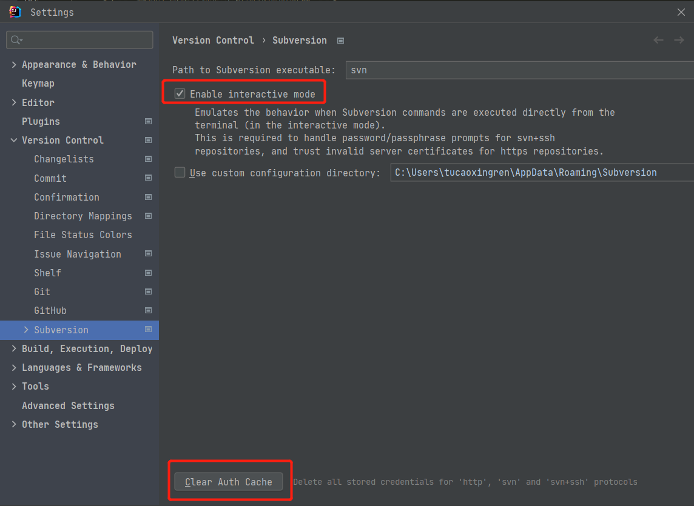

## 设置 java complier
-encoding utf-8

##  设置单个文件运行编码
 -Dfile.encoding=GBK

## tomcat乱码

tomcat / conf 目录下，设置 logging.properties 增加

java.util.logging.ConsoleHandler.encoding = GBK

## SVN频繁弹出验证窗口

## 拉取maven报错maven-default-http-blocker

[IDEA2021.3.2拉取maven报错maven-default-http-blocker解决方法](https://blog.csdn.net/21aspnet/article/details/123418238)

## Datebase插件 jdbc driver 下载失败

修改下面的文件，重启IDEA，修改前注意备份

C:\Users\tucaoxingren\AppData\Roaming\JetBrains\IntelliJIdea2022.2\jdbc-drivers\jdbc-drivers.xml

批量替换`https://repo1.maven.org/maven2` 替换为 `http://maven.aliyun.com/nexus/content/repositories/central`

