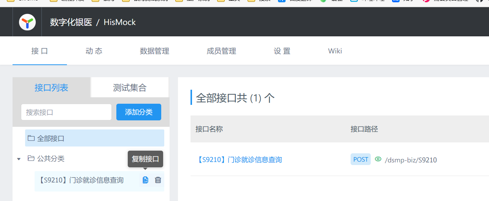

# 久远银海数字化银医平台开发规范


## 变更说明

| 时间       | 说明                                                         | 变更人 |
| ---------- | ------------------------------------------------------------ | ------ |
| 2022/11/25 | 1. 初次提交                                                  | 张常浩 |
| 2023/3/15  | 1. 修改 包package规范<br/>2. 修改 工具类说明<br/>3. 修改 代码生成说明<br/>4. 修改 字典说明及字典校验注解使用说明<br/>5. 新增 动态数据源使用说明<br/>6. 新增 对外接口开发流程说明<br/>7. 新增 适配代码开发流程说明<br/>8. 新增 平台适配模块路由配置说明<br/>9. 修改 Mybatis-Plus 使用规范<br/>10. 新增 调用外部系统接口流程说明 | 张常浩 |
| 2023/4/10  | 1. 新增 银医平台调用业务系统（银医标准）接口的开发说明<br/>2. 工具类说明 新增SeqGenUtil | 张常浩 |
| 2023/4/13  | 1. 新增 公共代码说明                                         | 张常浩 |
| 2023/4/18  | 1. 新增 Mock说明                                             | 张常浩 |
| 2023/5/23  | 1. 修改 字典说明及字典校验注解使用说明                       | 张常浩 |
| 2023/6/21  | 1. 新增 银医平台调用业务系统（银医标准）接口的开发说明->接口输出参数校验说明 | 张常浩 |
| 2023/7/20  | 1. 修改 工具类说明 新增DsmpApiUtil、PageUtil；新增注解DictConvert<br/>2. 新增 银海HIS统一服务适配说明 | 张常浩 |
| 2023/8/3   | 1. 修改 异常规范                                             | 张常浩 |
| 2023/8/8   | 1. 新增 后端->WebService 接口规范<br/>2. 新增 后端 -> 工具类说明 SpringUtil<br/>3. 新增 后端 -> 其它代码规范 静态获取Spring Bean实例的规范 | 张常浩 |
| 2023/8/31  | 1. 新增 后端->字典转换注解使用说明<br/>2. 新增 后端->字典转换说明 | 张常浩 |
| 2023/12/26 | 1. 新增 后端 -> 数据权限说明<br/>2. 新增 前端 -> 公共组件说明 | 张常浩 |
| 2024/1/3   | 1. 新增 报表开发规范<br/>2. 修改 后端 -> 数据权限说明        | 张常浩 |
| 2024/1/8   | 1. 修改 后端 -> 数据权限说明<br/>2. 新增 前端 -> 公共组件 -> 医药机构院区选择 | 张常浩 |
| 2024/1/19  | 1. 修改 后端 -> Service规范<br/>2. 修改 后端 -> 数据库规范 -> 事务规范<br/>3. 修改 后端 -> 数据库规范 -> SQL规范<br/>4. 修改 报表开发规范 -> 报表模版管理<br/>5. 新增 前端 -> 界面规范-->功能规范<br/>6. 新增 开发过程文档归档规范<br/>7. 新增GIT使用规范。 | 王金华 |
| 2024/5/27  | 1. 对外接口开发流程说明，输入参数说明新增数据权限参数说明    | 张常浩 |


## GIT使用规范

1. GIT客户端配置：设置`user.name`与`user.emali`

   ```shell
   # --global 代表全局设置 没有此选项时只能在项目根目录下执行，即为当前项目指定
   git config --global user.name 姓名（公司项目请使用GitLab账号的昵称即自己的汉字名字）
   git config --global user.email 邮箱地址（公司项目请使用公司邮箱，必须设置正确，否则Gitlab提交记录的作者信息将无法正确关联）
   ```

2. 除管理员外禁止直接向master、dev分支`push`，已设置保护，管理员需谨慎操作，避免默认push到master、dev。

3. 新建个人分支，分支名称可以是开发者姓名或当前任务、当前开发需求简述，新建分支有如下方法。

   - 无特殊需求，统一采用银海通账号进行命名，特殊需求以银海通账号前置命名。
   - 方式一：在云效平台->代码托管->分支->新建分支，最后在本地`pull`刚才新建的分支。
   - 方式二：在`GitLab`平台->新建分支，最后在本地`pull`刚才新建的分支。

4. 切换到个人分支：远程创建分支后`pull`到本地后，需要手工切换分支`git checkout 远程git仓库标签 分支名称` 。

5. 在个人分支`commit`并`push`到远程git仓库。

6. 新建合并请求，注意合并请求只能选择dev分支。

   - 方式一：在云效平台->代码托管->合并请求->新建合并请求。
   - 方式二：在`GitLab`平台->合并请求->新建合并请求。

7. 合并请求遇到冲突时，从本地自行处理完冲突后再重新提交，禁止在远程参考上解决冲突。

8. 开发人员开发并单元测试完成后，由对应开发人员审核合并到`dev`分支的合并请求。

9. 根据开发内容如需集成测试，基于DEV开发分支打包发布测试环境，完成集成测试工作。

10. DEV开发分支测试通过后，由管理员提交合并分支到master分支。master分支作为最终发布到生成环境的代码版本。

## 前后端数据交互规范

1. 日期型数据字符串格式 统一为 `yyyy-MM-dd`  后端使用常量 `EnvUtil.FORMAT_DATE`  前端使用常量`BIZCONST.FORMAT_DATE`
2. 日期时间型数据字符串格式 统一为 `yyyy-MM-dd hh:mm:ss `后端使用常量 `EnvUtil.FORMAT_DATE_TIME`  前端使用常量`BIZCONST.FORMAT_DATE_TIME`
3. id类数据传输时必须使用字符串类型传输，即使全是数字的数据


## 前端

### 代码规范

1. 开发工具请安装eslint插件 使用eslint检查代码规范
2. 全局常量位置 `projectCommon/js/businessConst.js`
3. 公共用户信息获取方法`window.userExtTool.getUserInfo()`，用户信息包含了登录用户基础信息及平台扩展的用户信息

```json
{
    "userName": "测试002",
    "userImg": "person-head.png",
    "mainRoleName": "结算",
    "orgName": "一心堂药业集团股份有限公司昆明西部药城连锁一店",
    "loginId": "cs002",
    "sex": "0",
    "idCardNo": null,
    "roles": [
        {
            "roleId": "e717fed14b95416d9186db2745cea0c6",
            "roleName": "结算",
            "orgId": "fd811ab9c30440088df3e29ea784460a",
            "roleType": "01",
            "effective": "1",
            "effectiveTime": null,
            "createUser": "1",
            "createTime": "2022-07-14 09:08:22",
            "defaultRole": "0",
            "createUserName": null,
            "idPath": null,
            "namePath": null,
            "roleSign": null,
            "roleDesc": null,
            "subordinate": null,
            "roleMark": null,
            "authority": "ROLE_e717fed14b95416d9186db2745cea0c6",
            "attribute": "ROLE_e717fed14b95416d9186db2745cea0c6"
        }
    ],
    "avatar": null,
    "userId": "530101000000000161",
    "admdvs": "530102",
    "orgId": "b324f6bfe243439d954dd194c758cd11",
    "dataPermType": "3",
    "idCardType": null,
    "mainRoleId": "e717fed14b95416d9186db2745cea0c6",
    "customNo": "P53011201510",
    "selfdefOrgCode": "P53011201510",
    "passwordRSA": true,
    "isSSO": false,
    "passwordLevel": 3,
}
```


### 公共函数

1. `projectCommon/js/common-utils.js` 公共函数js 使用方法 `import { 方法1, 方法2, ...} from '@projectCommon/js/common-utils'`

### 公共组件

#### 医药机构选择

1. 引入`import autoMedinsCode from '@projectCommon/components/autoMedinsCode'`
2. 支持数据权限控制

#### 接入系统选择

1. 引入`import autoMedinsCode from '@projectCommon/components/autoAcssSysCode/autoAcssSysCode'`

#### 医疗集团选择

1. 引入`import autoMedinsCode from '@projectCommon/components/medGrpSelect/medGrpSelect'`
2. 支持数据权限控制


#### 医药机构院区选择

1. 引入`import AutoMedinsBrchCode from '@projectCommon/components/autoMedinsBrchCode'`
2. 支持数据权限控制


### 代码分层规范

#### vue 页面代码

```vue
<ta-table
    :columns="tableCols"
    :dataSource="tableData"
    :scroll="{x:900,y:100}"
    bordered
    :have-sn="true">
</ta-table>
```


#### vue JS代码

```js
// 表格列说明 使用 const 常量 常量名必须大写！！！
const TABLE_COLS = []

export default {
  data () {
    return {
      tableData: [],
      tableCols: TABLE_COLS
    }
  }
}
```


```vue
<!-- 页面代码 -->
<template>
  <ta-border-layout :show-padding="false" layout-type="fixTop" class="fit">
    <!-- 省略代码 -->
  </ta-border-layout>
</template>

<!-- JS代码 -->
<script>
import mixins from './mixins/mixins'

export default {
  mixins: [mixins],
}
</script>

<!-- 样式代码 -->
<style scoped type="text/less">
	@import "css/style.css";
</style>

```


```
# 目录结构
demotest # 模块名称
    │  demotest.html  # 模块html文件(要求跟模块同名)
    │  demotest.js    # 模块入口js  (要求跟模块同名 ,模块内插件声明也在该入口js中)
    │
    ├─modulePart      # 模块的功能目录(比如这里有个功能1 [modulePart1] 就放这个目录下,如果这个模块有多个功能,都放这个文件夹下)
    │  └─modulePart1  # 功能1
    │      │  modulePart1.vue  # 功能1的功能入口vue
    │      │  routes.js        # 功能1的路由声明
    │      │
    │      └─part              # 功能1用到的小组件(比如弹出框的内容等都放这个文件夹中,非必须,视情况存在）)
    │              partComponent.vue # 功能1用到的小组件
    │
    └─router     # 模块的路由配置目录，新增功能后都需要到该目录注册功能路由，这点后面还会提到
    index.js  # 路由入口文件
    routes.js # 模块下功能的路由加载

```

### 界面规范

#### 参考界面


#### 功能规范

功能实现不仅仅是为了增、删、改、查，开发过程需要考虑可用性、易用性、实用性，包括：关键指标显示，核心指标显示，指标摆放顺序，界面布局占比等等。

### 查询表单规范

1. 表单组中若有时间的查询条件 则时间查询条件应放在最前面 其次是使用最频繁的查询条件 
2. 按钮组应将主要的按钮放在最右边
3. 每行应放置至多4个表单
4. 按钮组放置在表单最后一行的最右边 无需独立一行
5. 表单数超过7个时 应将多余的表单设置为默认隐藏 且按钮组中要包含 显示/隐藏 多余表单的按钮
6. 注意设置`:label-col="BIZCONST.LABEL_COL" :wrapper-col="BIZCONST.WRAPPER_COL"`

示例


示例代码

```vue
<template>
  <div id="vue1" class="fit">
    <ta-border-layout layout-type="fixTop" class="fit">
      <ta-card slot="header" :bordered="false" :show-expand="false" title="检索条件">
        <ta-form :auto-form-create="(form)=>{this.searchForm = form}" :form-layout="true" :label-col="BIZCONST.LABEL_COL" :wrapper-col="BIZCONST.WRAPPER_COL">
          <ta-form-item label="结算日期" field-decorator-id="key1">
            <ta-range-picker
              :show-time="{ format: 'HH:mm:ss' }"
              format="YYYY-MM-DD HH:mm:ss"
              style="width: 100%"
            />
          </ta-form-item>
          <ta-form-item label="结算单号" field-decorator-id="key2">
            <ta-input placeholder="请输入结算单号" />
          </ta-form-item>
          <ta-form-item label="人员编号" field-decorator-id="key3">
            <ta-input placeholder="请输入人员编号" />
          </ta-form-item>
          <ta-form-item label="人员姓名" field-decorator-id="key4">
            <ta-input placeholder="请输入人员姓名" />
          </ta-form-item>
          <ta-form-item label="证件类型" field-decorator-id="key5">
            <ta-select collection-type="RX_CHK_STAS_CODG" :allow-clear="true" placeholder="请选择证件类型" />
          </ta-form-item>
          <ta-form-item label="证件号码" field-decorator-id="key6">
            <ta-input placeholder="请输入证件号码" />
          </ta-form-item>
          <ta-form-item label="就诊单号" field-decorator-id="key7">
            <ta-input placeholder="请输入就诊单号" />
          </ta-form-item>
          <ta-form-item label="医药机构编码" field-decorator-id="key8" :hidden="hiddenExtra">
            <ta-input placeholder="请输入医药机构编码" />
          </ta-form-item>
          <ta-form-item label="医药机构名称" field-decorator-id="key9" :hidden="hiddenExtra">
            <ta-input placeholder="请输入医药机构名称" />
          </ta-form-item>
          <div align="right" style="width: 100%">
            <ta-button icon="down" :hidden="!hiddenExtra" @click="hiddenExtra = false">
              展开
            </ta-button>
            <ta-button icon="up" :hidden="hiddenExtra" @click="hiddenExtra = true">
              收起
            </ta-button>
            <ta-button @click="fnResetForm">
              重置
            </ta-button>
            <ta-button type="primary" @click="fnQuery">
              查询
            </ta-button>
          </div>
        </ta-form>
      </ta-card>
      <ta-card title="查询列表" class="fit" />
    </ta-border-layout>
  </div>
</template>

<script>

export default {
  name: 'modulePart1',
  components: { },
  data () {
    return {
      hiddenExtra: true,
    }
  },
  methods: {
    fnQuery () {
    },
    fnResetForm () {
      this.searchForm.resetFields()
    },
  },
}
</script>

<style scoped type="text/less">

</style>

```


### 业务组件规范

1. 新增数据、修改数据、展示数据详情 应使用 `ta-drawer`  新增数据、修改数据时建议设置 `maskClosable=false`
2. 公共的业务组件代码请放在 `src/projectCommon/components`，需要使用或开发通用业务组件时，先到此目录下核实组件。
3. 禁止在弹窗中再次弹窗（提示弹窗除外）。


### 组件规范

#### 按钮 ta-button

1. 至少要有一个主输入按钮 type="primary"
2. 一组按钮组中只能有一个主要按钮且主要按钮必须在最右边
3. 按钮中需要包含图标时，图标应在文字左边

#### 输入框 ta-input

1. 数据录入业务输入状态 应指定一个默认的输入焦点
2. 必须设置 `maxLength`

#### 弹出框 ta-modal

1. 注意设置`destroyOnClose = true` 特殊情况除外
2. 默认width = BIZCONST.MODEL_WIDTH
3. 默认height = BIZCONST.MODEL_HEIGHT

#### 列表展示

1. 使用 `ta-big-table` 不使用 `ta-table` 
2. 列表必须包含序号列 序号列应放在列表最左边并固定
3. 需要固定按钮列必须放在列表右边
4. 金额类数据必须靠右展示、其它数据请居中展示，金额类格式化统一 BigTable自带金额格式化 使用方法 `<ta-big-table-column field="sum" title="总金额" formatter="formatAmount"></ta-big-table-column> ` 更多big-table自带格式化请参见ta404官方文档
5. 表头居中展示

#### 省市联动组件

1. 使用 ta-cascader


#### 日期选择框 ta-date-picker

1. 日期型 `format="YYYY-MM-DD"`
2. 日期时间型 `format="YYYY-MM-DD HH:mm:ss"`


### 快捷键定义规范

1. 重置按钮和清屏按钮刷新统一使用“重置[C]”。查询按钮、检索按钮统一为“查询[Q]”
2. 快捷键定义：重置[C]【ALT+C】、查询[Q]【ALT+Q】、打印[P]【ALT+P】、保存[S]【ALT+S】、导出[E]【ALT+E】、导入[I]【ALT+I】、上传[U]【ALT+U】、删除[D]【ALT+D】、新增[N]【ALT+N】、编辑[E]【ALT+E】、撤销[R]【ALT+R】、校验[V]【ALT+V】、关闭[X]【ALT+X】、结算【ALT+B】、审核[A]【ALT+A】、选择[L]【ALT+L】、身份认证[K]【ALT+K】、二维码[M]【ALRT+M】

## 后端

### Ta+3 404 后端开发规范

[Ta+3 404 后端开发规范 | 银海技术研发部](http://172.20.23.216/Ta3404_doc@5.0-RELEASE/docs/docs/product/Ta404/ta404-back/5.0-release/dev_standard/Ta+3404后台开发规范.html#开发规范)
[阿里巴巴Java开发手册](06.Document\03.规范文档\阿里巴巴开发规范\阿里巴巴Java开发手册1.4.0.pdf)

### 模块说明

参考 03.Design\01.总体设计\数字化银医平台模块分层.xlsx


### 包package规范

全部表DO 在 `com.yinhai.dsmp.comm.db.entity`包下 

业务相关的Mapper、service请放在各自模块下


XXX-COMM 模块应尽可能只放接口类、工厂类、实体类处上述三种类型的代码外不应该放置在XXX-COMM模块

**推荐 代码命名规范 https://mp.weixin.qq.com/s/lHp7-eefHz65DEja5i3SCA**


| 分层            | 命名规范                                     | 说明                                       |
| ------------- | ---------------------------------------- | ---------------------------------------- |
| RestService层  | com.yinhai.dsmp.modulename.rest          | 控制层                                      |
| Service只读接口   | com.yinhai.dsmp.modulename.service.read  | 服务层                                      |
| Service读写接口   | com.yinhai.dsmp.modulename.service.write | 服务层                                      |
| Service只读接口实现 | com.yinhai.dsmp.modulename.service.read.impl | 服务层实现类                                   |
| Service读写接口实现 | com.yinhai.dsmp.modulename.service.write.impl | 服务层实现类                                   |
| Mapper只读接口    | com.yinhai.dsmp.modulename.mapper.read   | 持久层                                      |
| Mapper读写接口    | com.yinhai.dsmp.modulename.mapper.write  | 持久层                                      |
| DTO对象         | com.yinhai.dsmp.modulename.dto           | 业务实体 根据具体业务需求                            |
| 工厂类           | com.yinhai.dsmp.modulename.factory       | 工厂模式                                     |
| 支持类           | com.yinhai.dsmp.modulename.provider      | Provider = Strategy + Factory Method。它更高级一些，把策略模式和方法工厂揉在了一块，让人用起来很顺手。Provider一般是接口或者抽象类，以便能够完成子实现。 |
| 注册类           | com.yinhai.dsmp.modulename.config        | 对于Spring bean的自动注册等                      |
| 配置类           | com.yinhai.dsmp.modulename.autoconfig    | 接收配置文件中的可配置属性                            |
| Mapper接口      | com.yinhai.dsmp.modulename.basemapper    | 用于定义公共的Mapper方法，但无实现XML的mapper           |
| Mapper接口      | com.yinhai.dsmp.modulename.dynamicmapper | 动态数据源Mapper接口                            |
| Context       | com.yinhai.dsmp.modulename.context       | 如果你的程序执行，有一些变量，需要从函数执行的入口开始，一直传到大量子函数执行完毕之后。这些变量或者集合，如果以参数的形式传递，将会让代码变得冗长无比。这个时候，你就可以把变量统一塞到Context里面，以单个对象的形式进行传递。 |
| Holder        | com.yinhai.dsmp.modulename.holder        | 表示持有某个或者某类对象的引用，并可以对其进行统一管理。多见于不好回收的内存统一处理，或者一些全局集合容器的缓存。 |


### Service规范

事务控制加在service层，service必须读写分离，代码结构参考

仅包含数据库处理的类可以使用`@Service`注解，并以`Service`或`ServiceImpl`结尾，其它`SpringBean`请选择合适的`Spring`注解

```
service
    ├─read
    │  └─xxxReadService
    └─write
       └─xxxWriteService
```


### DTO、DO规范

1. **强制** 数据库实体对应Java对象类名必须以DO结尾
2. *推荐*  使用`lombok`为DTO、DO生成 get、set方法
3. **强制** 使用`lombok`时禁止使用`@Data`注解


### 工具类说明

1. `com.yinhai.ta404.expand.utils.jso.JacksonUtil` 使用`jackson` 转化 JSON字符串、Map、Java 实体类
   1. 使用默认的`ObjectMapper`，`JacksonUtil.getInstance().xxx`
   2. 使用自定义的`ObjectMapper`，`JacksonUtil.getInstance(ObjectMapper).xxx`

2. `com.yinhai.dsmp.comm.utils.ValidateObjUtils` 对象校验
3. `com.yinhai.dsmp.comm.util.OperatorUtil` 经办人信息获取、赋值工具类
4. `com.yinhai.ta404.expand.cache.core.TaCacheUtil` 对ta框架的缓存使用进行封装
5. `com.yinhai.dsmp.comm.util.cache.CacheRemoveUtil`对于项目中永久缓存的项目，应在此类中提供清除缓存的方法
6. `com.yinhai.dsmp.comm.mybatisplus.util.MybatisPlusUtil` mybatis-plus工具类
7. `com.yinhai.dsmp.comm.util.AdapterModuleUtil` 适配模块工具类
8. `com.yinhai.dsmp.comm.oss.provider.OssProvider` 文件存储工具类

   ```java
   // 获取文件下载地址示例
   UnifOssDDO unifOssD = OssProvider.getInstance().getUnifOssD(FileBizType fileBizType, String bizSn)
   String url = OssProvider.getInstance().getAddress(unifOssD.getUnifOssId());
   ```


1. `com.yinhai.dsmp.comm.util.SeqGenUtil` 序列号工具类 参考 03.Design\02.数据库设计\附件2.序列号.xls，此文件中“是否使用前缀”列的值=“是”时请使用`IdGeneratorUtil.getIdWithSeqPrefix`，为“否”请使用`IdGeneratorUtil.getStrId`
2. http请求框架使用 jodd-http 简单封装的工具类 `com.yinhai.dsmp.comm.util.HttpUtil`;封装的方法不满足需求时 可自行调用 注意：
   1. 必须设置 connectionTimeout 和 timeout；connectionTimeout 可以设置较小的值 例如 15秒
   2. 超时时间最多不超过3分钟
   3. 注意设置字符集
3. 其它常用工具类参考 `com.yinhai.yn.his:ta-expand-utils`依赖包
4. `com.yinhai.dsmp.api.comm.util.DsmpApiUtil` 对外接口工具类
5. `com.yinhai.dsmp.comm.util.PageUtil` 分页工具类
6. `com.yinhai.dsmp.comm.util.DictConvertUtil`字典转换工具类
7. `@DictConvert`注解可以用于在实体的属性上标注字典转换规则，然后调用`DictConvertUtil.objDictConvert`方法对实体中的全部加了此注解的属性按照转换规则转换
8. `com.yinhai.dsmp.comm.util.SpringBeanUtil` 获取Spring 管理的bean实例


### 父类继承规范

1. **强制** 自定义`Exception`请务必继承`com.yinhai.dsmp.comm.exceptions.BizException`


### 异常规范

1. **强制** 不同模块抛出异常时请使用各自模块已经继承`BizException`的异常
2. *推荐* 抛出异常时使用`com.yinhai.dsmp.comm.consts.ResCode`中定义的错误信息
3. *不推荐* 抛出异常时只有错误信息，没有错误代码或者错误代码未在`ResCode`中定义
4. 代码中不主动捕获异常（除非有明确需求），使用统一的异常处理层（AOP或拦截器）处理
5. 公共异常 `com.yinhai.dsmp.comm.exceptions.BizException`
6. 参数检查异常 `com.yinhai.dsmp.comm.exceptions.ParamException`
7. **强制** 禁止异常输出时仅输出`e.getMessage()`;反例：`log.error("异常" + e.getMessage())`；正确的示例：`log.error("异常", e)`
8. **强制** 禁止在catch异常时不做任何处理，应将异常完整输出（业务自定义异常除外）例如`log.error("异常", e)`


### 缓存使用规范

1. **强制** `cacheName `缓存名称 必须在 `com.yinhai.dsmp.comm.consts.CacheConst`中定义

2. 仅支持`ehcache`和`redis`实现方式

3. `cacheName `缓存名称以`#数字`结尾时 `#`号后的数字即为缓存的失效时间 单位秒 例如 `demoCache#10` 代表缓存名称为`demoCache`的缓存将在创建`10`秒后自动失效；缓存名称注意`ehcache`和`CacheConst`中定义保持一致；框架原本的`redis`缓存是不支持设置失效时间的；但是`ehcache`是支持的。

   举例 缓存名称A需要缓存5秒

   ```java
   TaCacheUtil.put("A#5", 缓存key, 缓存value);
   ```

   ehcache.xml

   ```xml
   <cache alias="A#5"> <!-- 注意这里的缓存名称也要带#5 因为要兼容redis -->
       <key-type>java.lang.String</key-type>
       <value-type>java.lang.Object</value-type>
       <expiry>
           <ttl unit="seconds">5</ttl>
       </expiry>
       <resources>
           <heap>200000</heap>
           <offheap unit="MB">10</offheap>
       </resources>
   </cache>
   ```


4. `com.yinhai.ta404.expand.cache.core.TaCacheUtil` 为封装的`ta404` 缓存工具类

5. 缓存名称中使用`:`分隔 建议使用业务模块名或代码模块名作为缓存名称前缀，例如`API:demoCache` (仅redis)

6. 支持`Spring cache`规范 支持 `@Cacheable`  `cache key`生成规则可以使用`keyGenerator="paramCacheKeyGenerator"`

7. `paramCacheKeyGenerator` 缓存key生成器 暂时只支持参数全为String 或 基础数据类型 若不是基础数据类型 需要重写`toString`方法

8. 单机环境推荐使用`ehcache`，集群环境推荐使用`redis`；虽然集群环境也可以使用`ehcache`，但是需要配置集群同步；

9. 设置了永不过期的缓存名称且可能存在数据更新的（例如 某基础信息表整体缓存后）必须在`CacheRemoveUtil`中编写清除缓存的方法写清说明 并告知相关开发人员在更新缓存相关表时记得清除缓存!


### 项目可配置属性规范

1. **强制** 配置名称规则 `dsmp.模块名.功能名.配置名` 
2. 外部系统接口地址必须可配置，即使像支付宝提供的接口的域名地址，代码中此接口地址也必须可配置，因为正式环境部署时会使用代理地址
3. 可配置属性键值前缀必须在`ScopeConst`中定义


### 常量规范

1. `com.yinhai.dsmp.comm.consts.DictConst` 字典相关常量
2. `com.yinhai.dsmp.comm.consts.BusinessConst` 业务相关常量
3. `com.yinhai.dsmp.comm.consts.SequenceConst` 序列名常量
4. `com.yinhai.dsmp.comm.consts.CacheConst` 缓存名称常量
5. `com.yinhai.dsmp.comm.consts.ScopeConst` 配置键名称常量 所有可配置键的前缀名称都必须配置在此
6. `com.yinhai.dsmp.comm.consts.OutSysCode` 外部系统编码必须维护在这里，前台外部系统信息维护功能的编码和名称应从这里取值，不能让用户输入
7. `com.yinhai.dsmp.comm.consts.OutSysIntfKpiCode` 外部系统所需指标名称必须全部配置在此处(OUT_SYS_INTF_KPI_B表数据也来源于此)
8. `com.yinhai.dsmp.comm.consts.AdapterBizType` PLAF_ADPT_RUTE_CFG_B表ADPT_BIZ_TYPE_CODE 枚举配置
9. `com.yinhai.dsmp.comm.consts.AdapterModuleType` PLAF_ADPT_RUTE_CFG_B表ADPT_MODU_TYPE_CODE 枚举配置


### Mybatis-Plus 使用规范

不直接使用Mybatis-plus的Mapper，应该使用Service

##### 主键填充规范

```java
/**
 * 数据库主键
 */
@TableId(value = "id", type = IdType.ASSIGN_ID)
private String id;
```


##### 自动填充规范

默认使用WebUtil.getCurUserAccountVo()获取到的用户信息填充经办人、经办机构信息具体填充规则请参考`com.yinhai.dsmp.comm.mybatisplus.handlers.MyMetaObjectHandler` 如果不想使用自动填充则必须为实体类对应属性赋值


实体类下列属性必须指定填充规则

```java
/**
 * 有效标志
 */
@TableField(value = "VALI_FLAG", fill = FieldFill.INSERT)
private String valiFlag;

/**
 * 数据创建时间
 */
@TableField(value = "CRTE_TIME", fill = FieldFill.INSERT)
private Date crteTime;

/**
 * 数据更新时间
 */
@TableField(value = "UPDT_TIME", fill = FieldFill.INSERT_UPDATE)
private Date updtTime;

/**
 * 创建人ID
 */
@TableField(value = "CRTER_ID", fill = FieldFill.INSERT)
private String crterId;

/**
 * 创建人姓名
 */
@TableField(value = "CRTER_NAME", fill = FieldFill.INSERT)
private String crterName;

/**
 * 创建机构编号
 */
@TableField(value = "CRTE_OPTINS_NO", fill = FieldFill.INSERT)
private String crteOptinsNo;

/**
 * 经办人ID
 */
@TableField(value = "OPTER_ID", fill = FieldFill.INSERT_UPDATE)
private String opterId;

/**
 * 经办人姓名
 */
@TableField(value = "OPTER_NAME", fill = FieldFill.INSERT_UPDATE)
private String opterName;

/**
 * 经办时间
 */
@TableField(value = "OPT_TIME", fill = FieldFill.INSERT_UPDATE)
private Date optTime;

/**
 * 经办机构编号
 */
@TableField(value = "OPTINS_NO", fill = FieldFill.INSERT_UPDATE)
private String optinsNo;
```


##### 使用规范

1. 禁止使用 `boolean update(Wrapper<T> updateWrapper);` 此方法已被标记 `@Deprecated` 这种更新会导致自动填充失效

   ```java
   LambdaUpdateWrapper<FixmedinsInfoBDO> lambdaUpdateWrapper = new LambdaUpdateWrapper<>();
   lambdaUpdateWrapper.eq(FixmedinsInfoBDO::getFixmedinsInfoId, "KM53429153");
   lambdaUpdateWrapper.set(FixmedinsInfoBDO::getEnddate, new Date());
   // 应改为这种实现 new FixmedinsInfoBDO() 也可以是待更新的完整DO
   fixmedinsInfoBService.update(new FixmedinsInfoBDO(), lambdaUpdateWrapper);
   ```

2. 禁止为DO属性 添加 `updateStrategy = FieldStrategy.IGNORED` 防止误更新null

3. Wrapper 查询规范`Wrapper.eq(R column, Object val) `除非 val 确定不为空 否则应使用重载方法`eq(boolean condition, R column, Object val)`

4. `QueryWrapper` 建议改为使用 `LambdaQueryWrapper`

5. `UpdateWrapper` 建议改为使用 `LambdaUpdateWrapper`

6. 关于 空值更新 空值查询 说明 [Mybatis-Plus使用说明 (gitee.io)](http://tucaoxingrenzch.gitee.io/programingnote/#/Java框架/Mybatis-Plus使用说明)

7. `@Async`异步执行的方法中执行`insert`或者`update`时，由于不在同一线程框架`OperatorUtil.getOperatorDTO()`方法无法获取到当前登录账号信息，导致经办人信息获取失败，因此在调用异步方法前应手动获取经办人id、经办人姓名、经办人机构编号传入到方法中，代码参考如下

   ```java
   public class A {
       public void callAsync() {
           B b = new B();
           OperatorDTO opterInfo = new OpterInfo(OperatorUtil.getOperatorDTO());
           b.async(opterInfo);
       }
   }
   
   public class B {
       
       @Async
       public void async(OperatorDTO opterInfo) {
           SomeDO d = new SomeDO();
           // insert操作 手动set创建人信息
           // update操作 手动set经办人信息
           d.setCrterId(opterInfo.getOperatorId());
       }
   }
   ```


##### 空值更新

1. 空值更新示例

   ```java
   // 整个DO都更新时才可以用这种
   FixmedinsInfoBDO updateDO = fixmedinsInfoBService.getById("KM53429153");
   updateDO.setEnddate(null);
   fixmedinsInfoBMapper.alwaysUpdateSomeColumnById(updateDO);

   或
   // 推荐使用下面的方式    
   UpdateWrapper<FixmedinsInfoBDO> updateWrapper = new UpdateWrapper<>();
   LambdaUpdateWrapper<FixmedinsInfoBDO> lambdaUpdateWrapper = new LambdaUpdateWrapper<>();
   lambdaUpdateWrapper.eq(FixmedinsInfoBDO::getFixmedinsInfoId, "KM53429153");
   lambdaUpdateWrapper.set(FixmedinsInfoBDO::getEnddate, null);
   fixmedinsInfoBService.update(new FixmedinsInfoBDO(), lambdaUpdateWrapper);
   ```

2. 禁止在 DO上添加 `updateStrategy = FieldStrategy.IGNORED` 防止误更新null

3. 不支持联合主键 不支持 Mybatis-plus Plus 框架的`updateByMultiId` 

4. 对与上述方法不满足的业务需求 请直接使用Mybatis


##### 空值查询

1. 空值查询示例

   ```java
   QueryWrapper queryWrapper = new QueryWrapper<>();
   queryDO.setFixmedinsInfoId("KM53429153");
   queryDO.setFixmedinsCode("");
   queryWrapper.setEntity(queryDO);
   list = fixmedinsInfoBService.list(queryWrapper);
   
   或
   LambdaQueryWrapper queryWrapper = new LambdaQueryWrapper<>();
   lambdaQueryWrapper.eq(FixmedinsInfoBDO::getFixmedinsInfoId, "KM53429153");
   // 如果确实要查询空字符串值 则使用 StringUitls.isEmpty("")
   lambdaQueryWrapper.eq(StringUitls.isNotEmpty(""), FixmedinsInfoBDO::getFixmedinsCode, "");
   list = fixmedinsInfoBService.list(queryWrapper);   
   
   ```


### 数据库规范


#### SQL规范

1. **强制** 单表增删查改使用`Mybatis-Plus`
2. **强制** 使用`MyBatis-Plus`的批量更新和插入（基于JDBC Batch）而不是在`SQL`中用`foreach`拼`SQL`
3. **强制** 不要写带有所有条件以if-empty开关的通用查询语句，根据具体业务需要给定参数（避免没有控住条件查了全表）；带`if-empty`的通用查询语句只在前台分页查询中使用，一定要分页使用
4. 对拼接的`in`语句条件需要先判空，如果为空给与固定结果而不执行`SQL `
5. **强制** `update`语句和`delete`语句一定要以键为条件处理，不能使用带`if-empty`拼接条件的语句
6. 不同查询条件的SQL语句需要单独写，不能使用判断条件拼接组合使用
7. **强制** 禁止使用函数、存储过程
8. `update` 空值 统一为更新为`null`  `Oracle` `null`与空字符一样  `MySql` 不一样
9. **强制** SQL语句必须检查是否使用到分区字段、索引字段以及检查执行计划是否正确


#### 主键生成规范

1. **强制** 使用`IdGeneratorUtil.getStrId(序列名称)` 获取id
2. **强制** 使用`Mybatis-Plus`时在实体主键的属性上必须加上注解`@TableId(type = IdType.ASSIGN_ID)`
3. `Mybatis-plus` 结合` IdGeneratorUtil` 自动填充主键 序列名规则如下
   1. 如果`Entity`类 有 `@Seq(SequenceEnum.SE_GLOBAL_EVENT) ` 注解，则按注解指定的序列获取
   2. 如果`Entity`类 有 `@TableName`注解，则按表名前加 `SE_` 后加 `_ID` 查注解，查到就直接使用
         比如：`ACSS_SYS_CFG_B => SE_ACSS_SYS_CFG_B_ID`
   3. 如果没有查到注解，按`Entity`类名称（去掉DO后缀）按大小写转下划线后 也是加 `SE_` 和 `_ID` 加后缀
   4. 如果都不行，就使用默认的 `SE_DEFAULT`


#### 事务规范

1. **强制** 使用了`@Service`注解的`Spring Bean`必须选择合适的事务注解
   1. 不开启数据库事务`@NoTransactional`
   2. 读写事务`@TaTransactional`
   3. 只读事务`@TaTransactional(readOnly = true)`
2. **强制**  禁止在存在数据库事务的方法中调用外部系统，必须调用时必须设置超时时间，且不能超过3秒
3. **强制**  接口层、Rest层不需要添加事务，事务操作也不能写在Rest层。批量业务一个事务多表操作建议通过子Service进行事务管理分批提交
4. 更多数据库事务规范请参考研发中心关于Ta404框架的事务说明 [多数据源和事务使用文档 | 银海技术研发部](http://172.20.23.216/Ta3404_doc@5.3-RELEASE/docs/docs/product/Ta404/ta404-back/5.3.0-release/developer-guide/doc/事务配置.html#数据源事务说明)


#### 分页查询规范

1. 使用Mybatis-plus做分页查询时 使用`dppRestService`中`convertMybatisPlusPage`方法完成Ta404分页参数转换为Mybatis-Plus分页参数，使用`setMybatisPlusPageBean`方法将Mybatis-Plus分页结果转为Ta404分页结果并赋值到前台
2. 使用Mybatis做分页查询时 Mapper继承`dppMapper`后使用`beginPager`、`endPager`方法完成分页


### 其它代码规范

1. **强制** `JSON`、`XML`字符串序列化与反序列化 使用 `Jackson` 禁止使用 `FastJSON`
2. **强制** 参数检查使用`JSR303 Bean`校验注解，必须指定`message`，注意校验组的支持
3. 注意使用`@Size`注解
4. 建议使用`Spring`的 `@NonNull`和 `@Nullable` 注解标记函数返回值和参数 此注解会被`SonarLint`扫描检测
5. **强制** 以POJO传递参数，除非有明确需要，否则避免使用简单Map传递业务参数
   1. 部分需要返回2 ~ 3个对象又不想创建单独Bean的时候，可以使用`commons-lang3`的`Pair`或`Triple`
   2. 为泛型指定类型参数
6. 代码中不主动捕获异常（除非有明确需求），使用统一的异常处理层（AOP或拦截器）处理
   1. 捕获异常后，一定要log、throw原异常或 throw 新异常（以原异常为cause），不能只使用原异常消息文本，但不保留异常栈的行为（除非有明确需求）
7. 代码提交前请使用Sonarlint扫描修复后提交
8. restService中 `@RestService({"web/子系统名/模块名/功能名"})` 或 `@RestService({"api/子系统名/模块名/功能名"})` 例如  `@RestService({"web/hss/common/dictManage"})` 
9. **强制** comm模块`com.yinhai.dsmp.comm.db`包下为`Mybatis-Plus`自动生成 禁止添加任何方法 即使是单表查询也请放到各自业务模块中，如果有公共查询、新增、修改需求 可以在comm模块`com.yinhai.dsmp.comm.service`包下建立service
10. Mapper接口类如果存在对应的XML文件则不要在类上添加`@Mapper`注解
11. POJO 校验时 属性非基本对象类型时 应使用`@Valid`注解 如下图
    1. 
12. **建议** DO、DTO、VO 间互相复制 尽量不使用`BeanUtils.copyProperties`等属性复制工具方法 存在以下
    1. 弊端
       1. 多数属性复制工具方法基于反射，效率差
       2. 属性类型不匹配 会存在属性复制丢失
       3. 容易多复制属性

    2. 建议使用插件生成 set方法赋值
       1. 推荐插件 IDEA 插件 vo2dto
       2. vo2dto 插件使用示例 下面的代码 publicInDTO的数据复制到writeDTO中 
       3. 使用参考下图(下图是gif图)如无法预览，请直接查看`久远银海数字化银医平台开发规范.assets/vo2dto使用演示.gif`
       4. 
13. 代码注释规范
    1. 类、类属性、类方法的注释必须使用 Javadoc 规范，使用`/**内容*/`格式，不得使用`// xxx `格式。
    2. 方法内部单行注释，在被注释语句上方另起一行，使用`// xxx`注释。方法内部多行注释使用`/* */`注释，注意与代码对齐。
    3. 所有的枚举类型字段必须要有注释，说明每个数据项的用途。
    4. 特殊注释标记，请注明标记人与标记时间。注意及时处理这些标记，通过标记扫描，经常清理此类标记。线上故障有时候就是来源于这些标记处的代码。
       1. `TODO`:待办事宜，表示需要正式使用前需要完成的，但目前还未实现的功能。（ 标记人，标记时间，以及可选的准备实现的内容）
       2. `FUTURE`:待改进，表示已经实现可以使用但后续需要改进的。（ 需要做改进内容说明）
       3. `MARK`:需要注意内容，表示非常重要的内容，希望别人直接看到的。（需要添加内容描述）
       4. `FIXME`:错误不能工作的，在注释中用 FIXME 标记某代码是错误的，而且不能工作，需要及时纠正的情况。
    5. 详细内容请参照`阿里巴巴Java开发手册`内容。

14. 需要静态获取Spring的Bean实例时可以在Bean实例类中添加`getInstance`方法，示例如下

    ```java
    @Configuration
    @ConfigurationProperties(ScopeConst.CASH_PAY_SQB)
    @Getter
    @Setter
    public class XxxProperties {
    
        /**
         * 获取静态工厂类
         */
        public static XxxProperties getInstance() {
            return SpringUtils.getBean(XxxProperties.class);
        }
    }
    ```


### 代码生成说明

1. Mybatis-Plus 代码生成 执行`MybatisPlusAutoGenerate.main`方法 注意修改生成目录`PROJECT_PATH`
   1. 新增的表可以使用此方法生成；
   2. 已有的表不建议使用，建议直接修改对应DO
2. 从接口文档快速生成DTO代码 GenDTOFromApiWord.main
3. 根模块`pom.xml` 注意取消注释`<module>SUPPORT/dev-support</module>`但是不要提交

### 常见质检问题

1. `Exception.printStackTrace();` 改为 `log.error("错误标记", e)`
2. 注意删除未使用的变量
3. `implements Serializable`的类必须加 `serialVersionUID` 确认不要进行网络传输、缓存等即不需要序列化的DTO、DO等可以不用`implements Serializable`
4. 空方法、空构造方法 请添加一行注释 否则质检会认为是忘记实现代码了 例如 `// Do nothing`
5. unused import 未使用到的import 注意删除 
   1. 推荐 使用idea提交代码时勾选 `Optimize imports`即可
   2. idea 安装插件 `Save actions`后在设置中 `Other Settings > Save Actions` 勾选 `Optimize imports`即可


### 字典说明及字典校验注解使用说明

1. 字典校验注解`DictMatch`
   1. 使用示例 `@DictMatch(DictConst.DICT_TYPE_PSN_CERT_TYPE)` 在“DATA_DIC_A”表存在的字典可以使用此种方式
   2. 使用示例 `@DictMatch(values = {"01", "02"})` 在字典表不存在的可以直接指定值范围
   3. 用于验证输入值是否在给定字典范围内
2. ~~为了兼容门户系统 前端功能开发注意下 字典类型必须加个前缀 "DSMP_" 例如 data_dic_a表dic_type_code=DB_TYPE 则在前端使用时必须 DSMP_DB_TYPE~~
3. 为了兼容门户系统 后端禁止使用`com.yinhai.ta404.module.dict.util.DictUtils` 请使用`com.yinhai.ta404.expand.dict.util.DictUtil`
4. 为了兼容门户系统 后端根据字典值获取字典描述方法 应使用 `com.yinhai.ta404.expand.dict.util.DictUtil.getAuthorityDictDesc(String codeType, String codes) `
5. 为了兼容门户系统 后端字典描述获取字典值方法 应使用 `com.yinhai.ta404.expand.dict.util.DictUtil.getAuthorityDictValue(String codeType, String desc) `


### <span id = "DictConvert">字典转换注解使用说明</span>

1. 使用示例 `@DictConvert(convertSysCode = BusinessConst.OUT_SYS_CODE_GB_T, dictType = DictConst.DICT_TYPE_NTLY, convertDictType = DictConst.DICT_TYPE_GB_T_2659_2000)` 即将外部系统GB_T(国标)与本系统字典进行转换，无转换值时维持原值，有转换值时直接替换原值
2. 对DTO加上 `@DictConvert`注解后即可使用`DictConvertUtil`工具类快速对此DTO的字典进行转换，此工具类一般在代码公共处理处使用，具体业务代码无需使用。
3. 注解内容中的字典类别建议都使用常量；银医平台字典类别常量命名规则`DICT_TYPE_银医字典类别`，其它系统的命名规则`DICT_TYPE_+"对应的外部系统OUT_SYS_CODE的+外部系统字典类别"`，可以参考本章节第一点的示例


### 数据权限说明

1. 后端功能必须判断数据权限：只能医药机构使用的功能必须添加数据权限校验和条件，只能管理员使用的功能必须校验管理员权限。

   ```java
   // REST 中数据权限校验
   validDataPerm(true, DictConst.DATA_PERM_TYPE_0);
   // 获取数据权限信息
   getCurUserAccountDTO().getFixmedinsCode();
   getCurUserAccountDTO().getDataPermType();
   getCurUserAccountDTO().getSelfdefOrgCode();
   // 设置数据权限通用方法，复杂语句建议自行编写SQL语句和控制数据权限参数
   MybatisUtil.setFixmedinsDataPerm(queryWrapper, feeListDDO);
   // REST 中数据操作权限校验 例如 医药机构管理功能 新增仅限管理员账号或集团账号可以使用，此时可以使用下面的代码进行检查
   validDataPerm(DictConst.DATA_PERM_TYPE_0, DictConst.DATA_PERM_TYPE_1);
   // 或
   validDataPermHigh(DictConst.DATA_PERM_TYPE_1);
   ```

2. 数据新增、更新权限控制，对于导入功能等无法在前端控制数据权限的业务，可以使用`DataPermissionVerifyUtils.validDataOperatePermByMedinsCode`或`DataPermissionVerifyUtils.validDataOperatePermByMedGrpCode` 方法判断当前账号是否有权限操作指定数据

3. `MybatisPlusUtil.addQueryParamByDataPerm` 统一添加医疗集团、医药机构、医药机构院区查询条件


### 字典转换说明

1. DATA_DIC_CRSP_A.SYS_CODE标准遵循下列规则

   1. 银海ESB 
      1. hosp_plaf_dict_a.dic_data_souc='CT国家卫生健康委', SYS_CODE='CT',卫健标准字典,后端代码使用`BusinessConst.OUT_SYS_CODE_YINHAI_CT`
      2. hosp_plaf_dict_a.dic_data_souc='CV卫生信息系统数据元标准', 卫生系统标准字典,后端代码使用`BusinessConst.OUT_SYS_CODE_YINHAI_CY`
      3. hosp_plaf_dict_a.dic_data_souc='平台定义'或'CY公司标准', SYS_CODE='YINHAI_ESB',银海ESB标准字典,后端代码使用`BusinessConst.OUT_SYS_CODE_YINHAI_ESB`
      4. hosp_plaf_dict_a.dic_data_souc='国标', 国标标准字典,后端代码使用`BusinessConst.OUT_SYS_CODE_YINHAI_GB_T`
      5. hosp_plaf_dict_a.dic_data_souc='RC-HQMS', RC-HQMS标准字典,后端代码使用`BusinessConst.OUT_SYS_CODE_YINHAI_RC_HQMS`
      6. 《银海医院信息平台交互服务-便民服务(接入系统端).docx》此接口文档中有部分字典是直接使用银医平台的字典，无需转码
      7. 银医平台字典标准包含医保标准、国标标准 但是字典类别重新命名了，因此字典转换时注意 有些国标、医保字典是无需转码的
   2. 其它外部系统
      1. SYS_CODE = com.yinhai.dsmp.comm.consts.OutSysCode.name()
   3. 转换数据可以参考 SELECT * FROM hosp_plaf_dict_a

2. 注意整理字典转换sql语句

   ```sql
   insert into DATA_DIC_CRSP_A (DATA_DIC_CRSP_ID, SYS_CODE, DIC_TYPE_CODE, DIC_TYPE_NAME, DIC_VAL_CODE, DIC_VAL_NAME, CRSP_SYS_CODE, CRSP_DIC_TYPE_CODE, CRSP_DIC_TYPE_NAME, CRSP_DIC_VAL_CODE, CRSP_DIC_VAL_NAME, BEGNDATE, ENDDATE, MEMO, VALI_FLAG, CRTE_TIME, UPDT_TIME, CRTER_TYPE, CRTER_ID, CRTER_NAME, CRTE_OPTINS_NO, OPTER_ID, OPTER_NAME, OPT_TIME, OPTINS_NO) values (SE_DATA_DIC_CRSP_A.NEXTVAL, 'DSMP', '银医系统字典类别', '银医系统字典类别说明', '银医系统字典值', '银医系统字典值说明', '外部系统编号', '外部系统字典类别', '外部系统字典类别说明', '外部系统字典值', '外部系统字典值说明', to_date('2023-01-01', 'yyyy-mm-dd'), null, null, '1', SYSDATE, SYSDATE, '901', 'admin', '系统管理员', 'admin', 'admin', '系统管理员', SYSDATE, 'admin');
   insert into DATA_DIC_CRSP_A (DATA_DIC_CRSP_ID, SYS_CODE, DIC_TYPE_CODE, DIC_TYPE_NAME, DIC_VAL_CODE, DIC_VAL_NAME, CRSP_SYS_CODE, CRSP_DIC_TYPE_CODE, CRSP_DIC_TYPE_NAME, CRSP_DIC_VAL_CODE, CRSP_DIC_VAL_NAME, BEGNDATE, ENDDATE, MEMO, VALI_FLAG, CRTE_TIME, UPDT_TIME, CRTER_TYPE, CRTER_ID, CRTER_NAME, CRTE_OPTINS_NO, OPTER_ID, OPTER_NAME, OPT_TIME, OPTINS_NO) values (SE_DATA_DIC_CRSP_A.NEXTVAL, '外部系统编号', '外部系统字典类别', '外部系统字典类别说明', '外部系统字典值', '外部系统字典值说明', 'DSMP', '银医系统字典类别', '银医系统字典类别说明', '银医系统字典值', '银医系统字典值说明', to_date('2023-01-01', 'yyyy-mm-dd'), null, null, '1', SYSDATE, SYSDATE, '901', 'admin', '系统管理员', 'admin', 'admin', '系统管理员', SYSDATE, 'admin');
   ```


### 动态数据源使用说明

核心实现代码 `com.yinhai.dsmp.comm.datasource.dynamic`


#### 加载数据源

##### 启动时从配置文件中加载数据源

```yml
# -------------------------------------------------------------------
# 动态数据源配置
# -------------------------------------------------------------------
ta404.expand.datasource.dynamic:
  enabled: true
  init-source: yml # 注意初始化来源选择 yml
  druid:
    # 数据源示例
    lqhis: # 数据源名称使用医院医保编码
      url: jdbc:oracle:thin:@192.168.5.251:1522/yhhis
      driver-class-name: oracle.jdbc.OracleDriver #可不写
      username: lqhis
      password: lqhis
      # 初始化连接数
      initial-size: 3
      # 连接池最大连接数量
      max-active: 10
      # 获取链接超时时间 （毫秒）
      max-wait: 60000
```


##### 启动时从数据库中加载数据源

```yml
# -------------------------------------------------------------------
# 动态数据源配置
# -------------------------------------------------------------------
ta404.expand.datasource.dynamic:
  enabled: true
  init-source: database # 注意初始化来源选择 database
```


##### 动态加载

```java
@RestService
@RequestMapping("api/dev")
public class DevRestService {

    @Resource
    UserService userService;

    @Resource
    DynamicDataSourceManage dynamicDataSourceManage;

    @GetMapping("getCount")
    public int getCount() {
        // 加载数据源
        dynamicDataSourceManage.addDataSource("demo1",
                "oracle.jdbc.driver.OracleDriver",
                "jdbc:oracle:thin:@192.168.5.251:1521/orcl",
                "dpp",
                "dpp");
        // 切换数据源
        DataSourceContextHolder.set("demo1");
        System.out.println(userService.getCount());
        return userService.getCount();
    }
}
```


#### 使用说明

1. 事务控制在service层

2. 示例

   ```java
   /* Rest等调用Service的示例 */
   @Component
   public class HisV5ElectronicBillReadProvider implements ElectronicBillReadProvider {

       @Autowired(required = false)
       @Qualifier("hisV5ElectronicBillReadServiceImpl")
       ElectronicBillReadService hisV5ElectronicBillReadService;

       @Override
       public HisType getFitParam() {
           return HisType.HIS_V5;
       }

       @Override
       public S9101InDTO.OtpMdtrtInfo getElectronicBillOtpMdtrtInfo(ElectronicBillQueryDTO queryDTO) {
           // 切换数据源 数据源名称 应该为医院医保编码 注意修改 必须在service方法执行前切换数据源
   		DataSourceContextHolder.set("lqhis");
           // 开始执行service的方法
           return hisV5ElectronicBillReadService.getElectronicBillOtpMdtrtInfo(queryDTO);
       }
   }

   /* Service示例 */
   @Service
   // value 必须为"dynamicTransactionManager"，如果需要只读事务可以指定“readOnly = true”
   @Transactional(value = "dynamicTransactionManager", readOnly = true)
   // 必须加上此注解 即 不启用动态数据源时不实例化当前Service 注意调用此service的地方注意使用"@Autowired(required = false)"进行注入
   @ConditionalOnBean(DynamicDataSourceConfiguration.class)
   public class HisV5ElectronicBillReadServiceImpl implements ElectronicBillReadService {

       @Resource
       HisV5ElectronicBillReadMapper hisV5ElectronicBillReadMapper;

       @Override
       public S9101InDTO.OtpMdtrtInfo getElectronicBillOtpMdtrtInfo(ElectronicBillQueryDTO queryDTO) {
           return hisV5ElectronicBillReadMapper.getElectronicBillOtpMdtrtInfo(queryDTO);
       }
   }

   /* Service示例2 */
   @Service
   // value 必须为"dynamicTransactionManager"，如果需要只读事务可以指定“readOnly = true”
   @DynamicTransactional
   public class HisV5ElectronicBillReadServiceImpl implements ElectronicBillReadService {

       @Resource
       HisV5ElectronicBillReadMapper hisV5ElectronicBillReadMapper;

       @Override
       public S9101InDTO.OtpMdtrtInfo getElectronicBillOtpMdtrtInfo(ElectronicBillQueryDTO queryDTO) {
           return hisV5ElectronicBillReadMapper.getElectronicBillOtpMdtrtInfo(queryDTO);
       }
   }

   /* Mapper示例 */
   // 注意包路径 必须包含“dynamicmapper”
   package com.yinhai.dsmp.adapter.his.hisv5.ebill.dynamicmapper;
   public interface HisV5ElectronicBillReadMapper {

       /**
        * 获取电子票据 门诊就诊信息
        *
        * @param queryDTO 查询参数
        * @return 门诊就诊信息
        */
       S9101InDTO.OtpMdtrtInfo getElectronicBillOtpMdtrtInfo(ElectronicBillQueryDTO queryDTO);
   }

   ```

3. 配置文件说明

   ```yml
   # -------------------------------------------------------------------
   # 动态数据源配置
   # -------------------------------------------------------------------
   ta404.expand.datasource.dynamic:
     # 是否启用动态数据源
     enabled: false
     # mapper xml 扫描器 不建议修改
     mapper-locations: classpath*:mapper-dynamic/dsmp/**.xml
     # mapper interface 扫描器 多个路径请以逗号分隔 不建议修改
     mapper-base-packages: com.yinhai.dsmp.**.dynamicmapper
   ```


#### 跨库事务

示例

```java
package com.yinhai.dsmp.demo.service.impl;

import org.springframework.stereotype.Service;
import org.springframework.transaction.annotation.Transactional;

import javax.annotation.Resource;

@Service
@Transactional
public class DsmpDemoWriteServiceImpl {
    
    @Resource
    HisV5DemoWriteService hisV5DemoWriteService;

    @Override
    public void insert() {
        // dsmp insert操作
        dsmp.insert()
        // his 数据库操作请放到最后
        DataSourceContextHolder.set("lqhis");
        his.insert();
        // 如果his数据库操作结束后此方法又抛出异常则dsmp.insert()会回滚,his.insert();不会回滚
        int i = 1/0;
    }
}
```


```java
package com.yinhai.dsmp.demo.service.impl;

import com.yinhai.dsmp.demo.service.HisV5DemoWriteService
import org.springframework.stereotype.Service;
import org.springframework.transaction.annotation.Transactional;

@Service
@Transactional(value = "dynamicTransactionManager)
public class HisV5DemoWriteServiceImpl implements HisV5DemoWriteService {

    @Override
    public void insert() {
        // insert操作
    }
}
```


#### 数据库表DATA_SRC_B 密码加解密规则

```java
@Autowired
private CryptoService cryptoService;
// 加密
cryptoService.encryptWithAsymmetric("明文");

// 解密
cryptoService.decryptWithAsymmetric("密文");
```


### 对外接口开发流程说明

1. 处理入口`com.yinhai.dsmp.api.comm.handler.PublicRestHandler`

2. 输入输出DTO

   1. 模块 DSMP-API-COMM
   2. 包路径`com.yinhai.dsmp.api.biz.dto`
   3. 类名规则：输入DTO`接口编号InDTO`、输出DTO`接口编号OutDTO` 接口无输入或无输出时可以不要
   4. 输入参数中包含`uact_id`或`mdtrter_id`时，请将输入DTO`implements GetSpecialBizData`，实现获取账号id、就诊人id的方法，用于接口公共参数检查处，检查数据权限，防止越权

3. 接口处理

   1. 模块 DSMP-BIZ-CORE

   2. 无输入或无输出时使用Object类型

   3. 包路径`com.yinhai.dsmp.api.provider` 参考如下

      ```java
      package com.yinhai.dsmp.api.provider;

      import com.yinhai.dsmp.api.biz.dto.S9101InDTO;
      import com.yinhai.dsmp.api.biz.dto.S9101OutDTO;
      import com.yinhai.dsmp.api.comm.consts.TransNo;
      import com.yinhai.dsmp.api.comm.dto.ApiCommonDTO;
      import com.yinhai.dsmp.api.comm.dto.PublicInDTO;
      import com.yinhai.dsmp.api.comm.provider.PublicApiProvider;
      import org.springframework.stereotype.Component;

      import javax.annotation.Resource;

      /**
       * S9101 电子票据开具 处理类
       *
       * @author Zhang ChangHao
       * @time 2023/3/12 20:44
       */
      @Component
      public class PublicApiS9101Provider implements PublicApiProvider<S9101InDTO, S9101OutDTO> {

          @Override
          public TransNo getTransNo() {
              return TransNo.S9101;
          }

          @Override
          public S9101OutDTO handle(PublicInDTO publicInDTO, ApiCommonDTO apiCommonDTO, S9101InDTO input) {
              // 业务处理 注意此类不带数据库事务 数据库相关操作不要放在这里
              S9101OutDTO outDTO = new S9101OutDTO();
              return outDTO;
          }
      }
      ```

   4. 接口实现类不带数据库事务，如有数据库事务操作，请创建独立的带事务的service，在接口实现类中去调用带事务的service

   5. 接口枚举配置

      1. 模块 DSMP-API-COMM
      2. 路径 `com.yinhai.dsmp.api.comm.consts.TransNo`


### 适配代码开发流程说明


对于一个接口包含多个实现的适配代码开发说明


#### 互斥实现

即 多个实现间是互斥的不会同时存在


外部模块只需依赖 `DSMP-PAYADAPTER-COMM`公共模块，具体实现模块在打包时根据实际情况选择后依赖配置到启动模块即可


示例代码结构


配置文件

```yml
# -------------------------------------------------------------------
# 支付适配模块配置
# -------------------------------------------------------------------
dsmp.pay-adapter:
  electronic-bill-adapter: dpp # 定义适配实现模式
```


配置类，定义一个变量指定适配的模式 例如下面代码中的`electronicBillAdapter` 定义在`DSMP-PAYADAPTER-COMM`公共模块

```java
package com.yinhai.dsmp.adapter.pay.core.autoconfig;

import com.yinhai.dsmp.comm.consts.ScopeConst;
import lombok.Getter;
import lombok.Setter;
import org.springframework.boot.context.properties.ConfigurationProperties;
import org.springframework.context.annotation.Configuration;

/**
 * @author Zhang ChangHao
 * @time 2023/3/14 16:22
 */
@Getter
@Setter
@Configuration
@ConfigurationProperties(ScopeConst.PAY_ADAPTER)
public class PayAdapterProperties {

    /**
     * 电子票据适配接口模式
     */
    private ElectronicBillAdapterMode electronicBillAdapter;

    /**
     * 电子票据适配接口模式
     */
    public enum ElectronicBillAdapterMode {

        /**
         * DPP平台适配
         */
        DPP,
        /**
         * 第三方支付平台适配
         */
        TTP,
        DEFAULT
    }
}
```


适配接口 定义在`DSMP-PAYADAPTER-COMM`公共模块

```java
package com.yinhai.dsmp.adapter.pay.core.adapter;

import com.yinhai.dsmp.api.biz.dto.S9101InDTO;
import com.yinhai.dsmp.api.biz.dto.S9101OutDTO;

/**
 * 电子票据接口适配
 *
 * @author Zhang ChangHao
 * @time 2023/3/14 14:22
 */
public interface ElectronicBillAdapter {

    /**
     * 电子票据开具
     *
     * @param inDTO
     * @return
     */
    S9101OutDTO handle(S9101InDTO inDTO);
}
```


适配接口默认实现，即一个主要实现方式 定义在`DSMP-PAYADAPTER-COMM`公共模块

```java
package com.yinhai.dsmp.adapter.pay.core.adapter.impl;

import com.yinhai.dsmp.adapter.pay.core.adapter.ElectronicBillAdapter;
import com.yinhai.dsmp.api.biz.dto.S9101InDTO;
import com.yinhai.dsmp.api.biz.dto.S9101OutDTO;
import com.yinhai.dsmp.comm.consts.ResCode;
import com.yinhai.dsmp.comm.consts.ScopeConst;
import com.yinhai.dsmp.comm.exception.BizException;
import org.springframework.boot.autoconfigure.condition.ConditionalOnProperty;
import org.springframework.stereotype.Component;

/**
 * 电子票据接口适配
 * <p>默认实现</p>
 *
 * @author Zhang ChangHao
 * @time 2023/3/14 14:22
 */
@Component
@ConditionalOnProperty(value = ScopeConst.ELECTRONIC_BILL_ADAPTER, havingValue = "default", matchIfMissing = true)
public class DefaultElectronicBillAdapter implements ElectronicBillAdapter {

    @Override
    public S9101OutDTO handle(S9101InDTO inDTO) {
        // 默认实现可以直接抛出异常
        throw new BizException(ResCode.FAIL_NOT_EXIST_ELECTRONIC_BILL_ADAPTER);
    }
}
```


适配接口实现 定义在`DSMP-PAYADAPTER-DPP`具体适配实现模块

```java
package com.yinhai.dsmp.adapter.pay.dpp.adapter;

import com.yinhai.digitalize.sdk.dpp.core.consts.DppTransNo;
import com.yinhai.digitalize.sdk.dpp.core.dto.DppOutDTO;
import com.yinhai.dsmp.adapter.pay.core.adapter.ElectronicBillAdapter;
import com.yinhai.dsmp.adapter.pay.dpp.provider.DppRequestProvider;
import com.yinhai.dsmp.api.biz.dto.S9101InDTO;
import com.yinhai.dsmp.api.biz.dto.S9101OutDTO;
import com.yinhai.dsmp.comm.consts.ScopeConst;
import com.yinhai.ta404.expand.utils.json.JacksonUtil;
import org.springframework.boot.autoconfigure.condition.ConditionalOnProperty;
import org.springframework.stereotype.Component;

/**
 * DPP 电子票据适配
 *
 * @author Zhang ChangHao
 * @time 2023/3/14 14:26
 */
@Component
@ConditionalOnProperty(value = ScopeConst.ELECTRONIC_BILL_ADAPTER, havingValue = "dpp")
public class DppElectronicBillAdapter implements ElectronicBillAdapter {

    @Override
    public S9101OutDTO handle(S9101InDTO inDTO) {
        DppOutDTO outDTO = DppRequestProvider.call(DppTransNo.P601, JacksonUtil.getInstance().beanToJson(inDTO));
        return JacksonUtil.getInstance().jsonToBean(outDTO.getOutput(), S9101OutDTO.class);
    }
}
```


#### 并行实现

即多个实现可以同时被依赖，需要通过一个可以传入的参数确定使用哪个实现类


示例代码结构


适配接口 定义在`DSMP-PAYADAPTER-COMM`公共模块

```java
package com.yinhai.dsmp.adapter.pay.core.adapter;

import com.yinhai.dsmp.api.biz.dto.S9101InDTO;
import com.yinhai.dsmp.api.biz.dto.S9101OutDTO;
import com.yinhai.dsmp.comm.adapter.CommonAdapter;
import com.yinhai.dsmp.comm.dto.MedinsInfoDTO;
import com.yinhai.dsmp.module.consts.PayModule;

/**
 * 电子票据接口适配
 *
 * @author Zhang ChangHao
 * @time 2023/3/14 14:22
 */
public interface ElectronicBillPayAdapter extends CommonAdapter<PayModule> {

    PayModule getFitParam();

    /**
     * 电子票据开具
     *
     * @param inDTO
     * @return
     */
    S9101OutDTO handle(MedinsInfoDTO medinsInfoDTO, S9101InDTO inDTO);
}

```


工厂类，对于不同的传入参数返回不同的适配实现类 定义在`DSMP-PAYADAPTER-COMM`公共模块

```java
package com.yinhai.dsmp.adapter.pay.core.factory;

import com.yinhai.dsmp.adapter.pay.core.adapter.ElectronicBillPayAdapter;
import com.yinhai.dsmp.comm.consts.ResCode;
import com.yinhai.dsmp.comm.exception.BizException;
import com.yinhai.dsmp.comm.factory.CommonAdapterFactory;
import com.yinhai.dsmp.comm.util.AdapterModuleUtil;
import com.yinhai.dsmp.module.consts.PayModule;
import org.springframework.stereotype.Component;

import javax.annotation.PostConstruct;
import java.util.List;

/**
 * 电子票据支付适配工厂
 *
 * @author Zhang ChangHao
 * @time 2023/3/15 11:22
 */
@Component
public class ElectronicBillPayAdapterFactory extends CommonAdapterFactory<PayModule, ElectronicBillPayAdapter> {

    protected ElectronicBillPayAdapterFactory(List<ElectronicBillPayAdapter> list) {
        super(list);
    }

    private static ElectronicBillPayAdapterFactory instance;

    @Override
    public ElectronicBillPayAdapter getProvider(String adapterModuleType) {
        return getProvider(AdapterModuleUtil.getPayAdapter(adapterModuleType));
    }

    @Override
    public ElectronicBillPayAdapter getProvider(PayModule module) {
        ElectronicBillPayAdapter provider = super.getProvider(module);
        if (provider == null) {
            throw new BizException(ResCode.FAIL_NOT_EXIST_ELECTRONIC_BILL_ADAPTER);
        }
        return provider;
    }

    @PostConstruct
    public void init() {
        ElectronicBillPayAdapterFactory.instance = this;
    }

    public static ElectronicBillPayAdapterFactory getInstance() {
        return instance;
    }
}

```


适配实现 定义在`DSMP-PAYADAPTER-DPP`具体实现模块

```java
package com.yinhai.dsmp.adapter.pay.dpp.adapter;

import com.yinhai.digitalize.sdk.dpp.core.consts.DppTransNo;
import com.yinhai.digitalize.sdk.dpp.core.dto.DppOutDTO;
import com.yinhai.dsmp.adapter.pay.core.adapter.ElectronicBillPayAdapter;
import com.yinhai.dsmp.adapter.pay.dpp.provider.DppRequestProvider;
import com.yinhai.dsmp.api.biz.dto.S9101InDTO;
import com.yinhai.dsmp.api.biz.dto.S9101OutDTO;
import com.yinhai.dsmp.comm.dto.MedinsInfoDTO;
import com.yinhai.dsmp.comm.dto.OutSysBizLogDTO;
import com.yinhai.dsmp.module.consts.PayModule;
import com.yinhai.ta404.expand.utils.json.JacksonUtil;
import org.springframework.stereotype.Component;

/**
 * DPP 电子票据适配
 *
 * @author Zhang ChangHao
 * @time 2023/3/14 14:26
 */
@Component
public class DppElectronicBillPayAdapter implements ElectronicBillPayAdapter {

    @Override
    public PayModule getFitParam() {
        return PayModule.DPP;
    }

    @Override
    public S9101OutDTO handle(MedinsInfoDTO medinsInfoDTO, S9101InDTO inDTO) {
        OutSysBizLogDTO bizLogDTO = new OutSysBizLogDTO();
        bizLogDTO.setBizSn(inDTO.getData().getBizSn());
        DppOutDTO outDTO = DppRequestProvider.call(medinsInfoDTO, bizLogDTO, DppTransNo.P601, JacksonUtil.getInstance().beanToJson(inDTO));
        return JacksonUtil.getInstance().jsonToBean(outDTO.getOutput(), S9101OutDTO.class);
    }
}
```


调用示例

```java
package com.yinhai.dsmp.api.provider;

import com.yinhai.dsmp.adapter.his.ebill.adapter.ElectronicBillHisAdapter;
import com.yinhai.dsmp.adapter.his.ebill.dto.ElectronicBillQueryDTO;
import com.yinhai.dsmp.adapter.his.ebill.factory.ElectronicBillHisAdapterFactory;
import com.yinhai.dsmp.adapter.pay.core.adapter.ElectronicBillPayAdapter;
import com.yinhai.dsmp.adapter.pay.core.factory.ElectronicBillPayAdapterFactory;
import com.yinhai.dsmp.api.biz.dto.S9101InDTO;
import com.yinhai.dsmp.api.biz.dto.S9101OutDTO;
import com.yinhai.dsmp.api.comm.consts.TransNo;
import com.yinhai.dsmp.api.comm.dto.ApiCommonDTO;
import com.yinhai.dsmp.api.comm.dto.PublicInDTO;
import com.yinhai.dsmp.api.comm.provider.PublicApiProvider;
import com.yinhai.dsmp.comm.check.group.InHospitalGroup;
import com.yinhai.dsmp.comm.check.group.OutpatientGroup;
import com.yinhai.dsmp.comm.consts.DictConst;
import com.yinhai.dsmp.comm.util.ValidateObjUtils;
import org.springframework.stereotype.Component;

/**
 * S9101 电子票据开具 处理类
 *
 * @author Zhang ChangHao
 * @time 2023/3/12 20:44
 */
@Component
public class PublicApiS9101Provider implements PublicApiProvider<S9101InDTO, S9101OutDTO> {

    @Override
    public TransNo getTransNo() {
        return TransNo.S9101;
    }

    @Override
    public S9101OutDTO handle(PublicInDTO publicInDTO, ApiCommonDTO apiCommonDTO, S9101InDTO input) {
        S9101InDTO.Data data = input.getData();
        
        // 获取适配模块的类型 注意传入正确的业务类型 即下面代码中的 DictConst.ADPT_BIZ_TYPE_PAY_E_BILL 具体规则参考“平台适配模块路由配置说明”
        String adapterModuleType = apiCommonDTO.getPlafAdptRuteCfgBMap().
            get(DictConst.ADPT_BIZ_TYPE_PAY_E_BILL);
        
        // 获取电子票据适配类实现类
        ElectronicBillPayAdapter electronicBillPayAdapter = ElectronicBillPayAdapterFactory.
            getInstance().
            getProvider(adapterModuleType);
        
        // 调用电子票据适配类
        S9101OutDTO outDTO = electronicBillPayAdapter.handle(apiCommonDTO.getMedinsInfoDTO(), input);

        // 记录业务数据
        apiCommonDTO.getBizLogDTO().setBizSn(input.getData().getBizSn());

        // todo 写本地数据库

        return outDTO;
    }
}

```


对于包含数据库代码的适配接口，由于适配实现必须包含`@Transactional`注解 导致无法通过工厂类进行注册，此时可以通过外面套一层不带`@Transactional`注解的Spring bean


### 平台适配模块路由配置说明

1. 数据表结构如下
2. 
3. adpt_biz_type_code 业务类型 用于匹配到后端代码的模块分层目录 例如 adpt_biz_type_code=HIS 后端代码此时路由到 DSMP-HISADAPTER目录
4. 
5. adpt_modu_type_code = HIS_V5 时 代码将路由到 DSMP-HISADAPTER-HISV5模块


### 调用外部系统接口流程说明

1. 外部系统返回实体建议实现`OutsideSysResponse`或继承`OutsideSysResponseBase`
2. 外部系统请求参数需要继承`OutsideSysBizParam`
3. 调用处`CommonOutSysProvider.request`方法注意`try-catch` 不要将例如Http超时异常抛出
4. 外部系统调用工具类请继承`CommonOutSysProvider`抽象类
5. 外部系统调用（即`CommonOutSysProvider.call`方法）完成后 若需要从外部系统输出中读取`OutSysBizLogDTO`业务参数可以调用`CommonInstanceFactory.getInstance().getOutSysTransLogWriteProvider().updateOutSysTransLog`更新业务参数
6. 参考代码

```java
package com.yinhai.dsmp.adapter.pay.dpp.provider;

import com.yinhai.digitalize.sdk.core.dto.*;
import com.yinhai.digitalize.sdk.dpp.*;
import com.yinhai.dsmp.adapter.pay.dpp.dto.*;
import com.yinhai.dsmp.comm.*;
import com.yinhai.ta404.expand.idgen.IdGeneratorUtil;
import com.yinhai.ta404.expand.utils.date.DateUtil;
import org.springframework.lang.NonNull;

import java.util.Map;

/**
 * 请求DPP平台工具类
 *
 * @author Zhang ChangHao
 * @time 2023/3/14 14:57
 */
public class DppRequestProvider extends CommonOutSysProvider<DppBizParam, DppResult> {

    private static DppRequestProvider instance;

    private DppRequestProvider() {
        // Do nothing
    }

    private static DppRequestProvider getInstance() {
        if (instance == null) {
            instance = new DppRequestProvider();
        }
        return instance;
    }

    /**
     * 请求DPP平台
     *
     * @return 交易输出
     */
    private static DppResult request(DppBizParam param) {
        DppResult dppResult = new DppResult();
        DppTransNo transNo = param.getTransNo();
        String paramJSONStr = param.getParamJSONStr();
        try {
            HttpConfigDTO httpConfigDTO = new HttpConfigDTO();
            RequestDpp requestDpp = new RequestDpp(httpConfigDTO);
            DppConfigDTO dppConfigDTO = new DppConfigDTO();
            MedinsInfoDTO medinsInfoDTO = param.getMedinsInfoDTO();
            // 获取外部系统信息
            OutsideSysInfoDTO outsideSysInfoDTO = getOutsideSysInfoDTO(medinsInfoDTO, param.getAccessSysInfoDTO());
            // 赋值外部系统信息
            dppResult.getOutsideSysTransLogParam().setOutsideSysInfoDTO(outsideSysInfoDTO);
            // 调用外部系统参数组装 
            // ... 省略
            
            // 开始调用外部系统
            DppSDKResult dppSDKResult = RequestDppClient.call(requestDpp, dppConfigDTO, transNo, msgId, paramJSONStr);
            setDppResult(dppResult, dppSDKResult);
            
            // 组装渠道日志参数
            OutsideSysRequest request = getOutsideSysRequest(dppSDKResult);
            request.setTransNo(transNo.name());
            request.setSenderSn(msgId);
            // 赋值渠道日志参数
            dppResult.getOutsideSysTransLogParam().setOutsideSysRequest(request);

        } catch (Exception e) {
            dppResult.setCode(SDKResult.Code.FAIL);
            dppResult.setErrMsg(e.getMessage());
        }
        return dppResult;
    }

    @NonNull
    @Override
    protected DppResult request(OutSysBizLogDTO bizLogDTO, DppBizParam param) {
        return request(param);
    }

    /**
     * 请求DPP平台
     *
     * @param transNo      DPP平台交易编号
     * @param paramJSONStr 交易输入JSON字符串
     * @return 交易输出
     */
    public static DppResult call(OutModuleParamDTO outModuleParamDTO, OutSysBizLogDTO bizLogDTO, DppTransNo transNo, String paramJSONStr) {
        DppBizParam dppParam = new DppBizParam();
        dppParam.setMedinsInfoDTO(outModuleParamDTO.getMedinsInfoDTO());
        dppParam.setAccessSysInfoDTO(outModuleParamDTO.getAccessSysInfoDTO());
        dppParam.setParamStr(paramJSONStr);
        dppParam.setTransNo(transNo);
        return getInstance().call(bizLogDTO, dppParam);
    }
}
```


### 银医平台调用业务系统（银医标准）接口的开发说明

1. 定义接口抽象类 代码模块`DSMP-HISADAPTER-COMM`
   1. 包路径 `com.yinhai.dsmp.adapter.his.core.adapter`
   2. 类名 `HisDSMPApi接口编号Adapter`
   3. 继承`com.yinhai.dsmp.adapter.his.core.adapter.HisDSMPApiAdapter`
   4. 重写`execute`方法 注意对`OutSysBizLogDTO`赋值，注意输入输出的参数检查
2. 编写默认实现，默认实现即his已按照《久远银海数字化银医平台医药机构接入规范》提供了标准的接口； 代码模块`DSMP-HISADAPTER-COMM`
   1. 包路径 `com.yinhai.dsmp.adapter.his.common.adapter`
   2. 类名`HisDSMPApi接口编号DefaultAdapter`
   3. 继承第一步中定义的接口抽象类
   4. 实现`com.yinhai.dsmp.adapter.his.common.adapter.HisDSMPApiDefaultAdapter`接口
   5. 重写`execute`方法 `return call(outSysBizLogDTO, medinsInfoDTO, inDTO);`
3. 编写HIS适配实现，即his未按照《久远银海数字化银医平台医药机构接入规范》提供接口，需要将his提供的接口转换为《久远银海数字化银医平台医药机构接入规范》的接口；包模块`DSMP-HISADAPTER-具体的HIS适配`
   1. 参考第二步在各自适配中进行实现


#### 接口输出参数校验说明

1. `public abstract class HisDSMPApiSxxxxAdapter extends HisDSMPApiAdapter` 抽象类中默认对输出校验 但不使用校验组即默认校验仅校验字典是否符合
2. SxxxxOutDTO `@NotEmpty`、 `@NotNull`、 `@Size` 注解与接口文档保持一致；默认添加 `com.yinhai.dsmp.api.biz.dto.HisDsmpApiGroup` 仅作为标记，标记默认不校验
3. 确实需要校验非空的指标建议自定义一个校验组，在具体的代码中校验，不要动抽象类的校验方法
4. 使用 `GenDTOFromApiWord` 生成的代码默认对非空字符串添加了`@Size(min=1` 建议去掉min=1 只保留max


#### 参考代码 以S9210示例

##### 接口抽象类

```java
package com.yinhai.dsmp.adapter.his.core.adapter;

import com.yinhai.dsmp.api.biz.dto.S9210InDTO;
import com.yinhai.dsmp.api.biz.dto.S9210OutDTO;
import com.yinhai.dsmp.api.comm.consts.TransNo;
import com.yinhai.dsmp.comm.dto.MedinsInfoDTO;
import com.yinhai.dsmp.comm.dto.OutSysBizLogDTO;
import com.yinhai.dsmp.comm.util.ValidateObjUtils;
import org.springframework.lang.NonNull;

/**
 * 门诊就诊信息查询 适配接口
 *
 * @author Zhang ChangHao
 * @time 2023/4/7 14:25
 */
public abstract class HisDSMPApiS9210Adapter extends HisDSMPApiAdapter<S9210InDTO, S9210OutDTO> {

    public final TransNo getTransNo() {
        return TransNo.S9210;
    }

    /**
     * @param inDTO         输入
     * @param medinsInfoDTO 医药机构信息
     * @return 输出
     */
    public final S9210OutDTO execute(@NonNull MedinsInfoDTO medinsInfoDTO, @NonNull S9210InDTO inDTO) {
        ValidateObjUtils.validate(inDTO);
        OutSysBizLogDTO outSysBizLogDTO = new OutSysBizLogDTO();
        outSysBizLogDTO.setPlafOrdNo(inDTO.getData().getPlafOrdNo());
        S9210OutDTO outDTO = execute(medinsInfoDTO, outSysBizLogDTO, inDTO);
        ValidateObjUtils.validate(outDTO);
        return outDTO;
    }

    /**
     * @param inDTO         输入
     * @param medinsInfoDTO 医药机构信息
     * @return 输出
     */
    protected abstract S9210OutDTO execute(@NonNull MedinsInfoDTO medinsInfoDTO, @NonNull OutSysBizLogDTO outSysBizLogDTO, S9210InDTO inDTO);

}
```


##### 默认实现

```java
package com.yinhai.dsmp.adapter.his.common.adapter;

import com.yinhai.dsmp.adapter.his.core.adapter.HisDSMPApiS9210Adapter;
import com.yinhai.dsmp.api.biz.dto.S9210InDTO;
import com.yinhai.dsmp.api.biz.dto.S9210OutDTO;
import com.yinhai.dsmp.comm.dto.MedinsInfoDTO;
import com.yinhai.dsmp.comm.dto.OutSysBizLogDTO;
import org.springframework.lang.NonNull;
import org.springframework.stereotype.Component;

/**
 * S9210 门诊就诊信息查询 默认实现
 *
 * @author Zhang ChangHao
 * @time 2023/4/7 14:30
 */
@Component
public class HisDSMPApiS9210DefaultAdapter extends HisDSMPApiS9210Adapter implements HisDSMPApiDefaultAdapter {

    @Override
    protected S9210OutDTO execute(@NonNull MedinsInfoDTO medinsInfoDTO, @NonNull OutSysBizLogDTO outSysBizLogDTO, S9210InDTO inDTO) {
        return call(outSysBizLogDTO, medinsInfoDTO, inDTO);
    }
}
```


##### HisV5适配实现

```java
package com.yinhai.dsmp.adapter.his.hisv5.api.adapter;

import com.yinhai.dsmp.adapter.his.core.adapter.HisDSMPApiS9210Adapter;
import com.yinhai.dsmp.adapter.his.ebill.service.ElectronicBillHisAdapterService;
import com.yinhai.dsmp.api.biz.dto.S9210InDTO;
import com.yinhai.dsmp.api.biz.dto.S9210OutDTO;
import com.yinhai.dsmp.api.biz.dto.S9250InDTO;
import com.yinhai.dsmp.comm.dto.MedinsInfoDTO;
import com.yinhai.dsmp.comm.dto.OutSysBizLogDTO;
import org.springframework.beans.factory.annotation.Autowired;
import org.springframework.beans.factory.annotation.Qualifier;
import org.springframework.lang.NonNull;
import org.springframework.stereotype.Component;

/**
 * S9210 门诊就诊信息查询 HisV5实现
 *
 * @author Zhang ChangHao
 * @time 2023/4/7 14:30
 */
@Component
public class HisDSMPApiS9210HisV5Adapter extends HisDSMPApiS9210Adapter implements HisDSMPApiHisV5Adapter {

    @Autowired(required = false)
    @Qualifier("electronicBillHisV5AdapterServiceImpl")
    ElectronicBillHisAdapterService electronicBillHisAdapterService;

    @Override
    protected S9210OutDTO execute(@NonNull MedinsInfoDTO medinsInfoDTO, @NonNull OutSysBizLogDTO outSysBizLogDTO, @NonNull S9210InDTO inDTO) {
        // 切换数据源
        changeDataSource(medinsInfoDTO.getMedinsB().getMedinsCode());
        S9250InDTO.OtpMdtrtInfo otpMdtrtInfo = electronicBillHisAdapterService.getElectronicBillOtpMdtrtInfo(inDTO.getData());
        S9210OutDTO outDTO = new S9210OutDTO();
        outDTO.setData(otpMdtrtInfo);
        return outDTO;
    }

}
```


##### 调用示例

```java
private S9250InDTO.OtpMdtrtInfo getElectronicBillOtpMdtrtInfo(ApiCommonDTO apiCommonDTO, S921XDataDTO s921XDataDTO) {
    HisDSMPApiS9210Adapter adapter = (HisDSMPApiS9210Adapter) HisDSMPApiAdapterFactory.getInstance().getAdapter(apiCommonDTO.getAdptModuType(DictConst.ADPT_BIZ_TYPE_HIS), TransNo.S9210);
    S9210InDTO s9210InDTO = new S9210InDTO();
    s9210InDTO.setData(s921XDataDTO);
    return adapter.execute(apiCommonDTO.getMedinsInfoDTO(), s9210InDTO).getData();
}
```


### 公共代码说明


#### CommonInstanceFactory

用于以静态方式获取一些全局常用的Service


#### 获取外部系统转码值

```
// 获取外部系统字典值
CommonInstanceFactory.getInstance().getAppConfigReadService().getOutSysDictValue
    
// 获取DSMP字典值
CommonInstanceFactory.getInstance().getAppConfigReadService().getDsmpDictValue
```


### Mock说明

1. 使用yapi作为数据Mock的工具

2. [YApi-教程 (hellosean1025.github.io)](https://hellosean1025.github.io/yapi/documents/index.html)

3. 访问地址 http://192.168.5.200:3000/ 管理员账号 admin@admin.com 密码 admin 建议自行注册一个用户，不使用管理员账号

4. Mock项目 `数字化银医/HisMock`

5. 新建Mock接口 建议直接复制S9210

   

6. 从接口文档快速生成Mock数据 使用`GenYapiFromApiWord.java`

   


#### 数据Mock

1. 遵循Mock.js规则 [Mock.js (mockjs.com)](http://mockjs.com/examples.html#Basic)
2. 常用Mock使用示例 [yapi中使用json-schema mock数据 - 腾讯云开发者社区-腾讯云 (tencent.com)](https://cloud.tencent.com/developer/article/1757259)


### Maven SNAPSHOT 拉取失败

```xml
<?xml version="1.0" encoding="UTF-8"?>
<settings xmlns="http://maven.apache.org/SETTINGS/1.0.0"
    xmlns:xsi="http://www.w3.org/2001/XMLSchema-instance" xsi:schemaLocation="http://maven.apache.org/SETTINGS/1.0.0 http://maven.apache.org/xsd/settings-1.0.0.xsd">

    <!-- 本地仓库存储路径,默认注释,根据开发人员开发环境调整 -->
    <localRepository>D:\repository\yhrepo</localRepository>

    <servers>
        <server>
            <id>public</id>
            <username>public</username>
            <password>yh@maven!002777</password>
        </server>

        <!-- 如果项目中有获取snapshot仓库，需要单独配置，id可以用public-snaphost -->
        <server>
            <id>public-snaphost</id>
            <username>public</username>
            <password>yh@maven!002777</password>
        </server>
        
    </servers>

    <mirrors>
        <mirror>
            <id>public</id>
            <mirrorOf>central</mirrorOf>
            <url>http://maven1.yinhaiyun.com/repository/public/</url>
        </mirror>
        <!-- 去除Maven3.8及以上版本强制仓库地址是https的限制 -->
        <mirror>
            <id>maven-default-http-blocker</id>
            <mirrorOf>!*</mirrorOf>
            <url>http://0.0.0.0/</url>
        </mirror>
    </mirrors>

    <profiles>
        <profile>
            <id>public</id>
            <repositories>
                <repository>
                    <id>public</id>
                    <url>http://maven1.yinhaiyun.com/repository/public/</url>
                    <releases>
                        <enabled>true</enabled>
                    </releases>
                    <!-- 启用快照版仓库 -->
                    <snapshots>
                        <enabled>true</enabled>
						<updatePolicy>always</updatePolicy>
                    </snapshots>
                </repository>
            </repositories>
        </profile>
    </profiles>
    <activeProfiles>
        <activeProfile>public</activeProfile>
    </activeProfiles>
</settings>

```


### 银海HIS统一服务适配说明

1. 字典转换注解示例：`@DictConvert(convertSysCode = BusinessConst.OUT_SYS_CODE_ESB, dictType = DictConst.DICT_TYPE_NTLY, convertDictType = DictConst.DICT_TYPE_YH_ESB_CV02_01_101)`

2. 其它关于字典转换注解的使用说明请参考[字典转换注解说明](#DictConvert)

3. 调用ESB、提供给ESB调用的交易输入DTO都继承`ConvenientBaseInDTO`，调用ESB的交易输出DTO继承`ConvenientBaseOutDTO`

4. 调用ESB、提供给ESB调用的交易枚举都写在`com.yinhai.dsmp.adapter.api.yhesb.core.consts.ESBTransNo`，调用ESB的交易必须配置`ESBTransNo.outClass`

5. 《银海医院信息平台交互服务-便民服务(接入系统端).docx》转为java DTO 可以使用 `04.Implement\dev-support工程下的GenCDSDTOFronWord.java`

6. ESB分页参数与银医分页参数之间互相转换可以直接使用 `setInPageParam`与`setOutPageParam`

7. `dev-support`项目下`GenCallESBParamDTOFile.java` 可以快速生成调用ESB接口的DTO文件

8. `dev-support`项目下`GenParamCompareCode.java` 可以快速根据《便民服务V5版本接口银医参数对照V1.0.xlsx》生成代码片段，注意此类有两个静态方法 分别对应，服务调用和服务提供，按需选择


#### 银医调用ESB适配

1. 需要适配的S交易输出DTO有分页的建议修改DTO `extends PageOutDTO` 方便使用 `PageUtil.page`做分页处理；因为分页交易适配的统一服务接口大多不支持分页；调用 `PageUtil.page`时第二个参数建议使用唯一标识排序后传入； `extends PageOutDTO` 注意要有无参的构造方法，否则Jackson序列化、反序列化会失败；可以参考 T1151OutDTO
2. 字典转换：公共代码以实现，具体业务代码无需实现，ESB的参数DTO注意添加`@DictConvert`即可
3. `CallConvenientServicesProvider.call`与`CallConvenientServicesProvider.callNoException` 都已经自动对输入、输出参数默认做字典转换


#### ESB调用银医适配

1. 外部系统以ESB标准`06.Document\05.内部接口\银海统一服务接口\银海医院信息平台交互服务-便民服务(接入系统端).docx`调用`03.Design\04.接口标准\久远银海数字化银医平台医药机构接入规范.docx`
2. 示例代码参考`UpdateOrderCreateProvider.java` ESB接口`updateOrderCreate` 调用 银医接口 `S9150`
3. 字典以各自接口标准中定义的为准，注意对需要做字典转换的指标加`@DictConvert`， 
4. 字典转换：公共代码已处理 自动将ESB输入参数中的字典转换为银医的字典标准，自动将银医输出的字典转为ESB的字典标准，参考`UpdateOrderCreateInDTO.java`


### WebService 接口规范

1. 接口地址 `/WebService/**` 配置`cxf.path` 前缀地址禁止修改

2. maven依赖未放置到公共模块，有需要的模块自行依赖

   ```xml
   <dependency>
       <groupId>org.springframework.boot</groupId>
       <artifactId>spring-boot-starter-web-services</artifactId>
   </dependency>
   <dependency>
       <groupId>org.apache.cxf</groupId>
       <artifactId>cxf-spring-boot-starter-jaxws</artifactId>
   </dependency>
   ```

3. 创建WebService接口 示例如下

   ```java
   package com.yinhai.dsmp.adapter.api.yhesb.soap;

   import com.yinhai.dsmp.adapter.api.yhesb.dto.EsbResponseDTO;

   import javax.jws.WebMethod;
   import javax.jws.WebParam;
   import javax.jws.WebResult;
   import javax.jws.WebService;

   @WebService(
           targetNamespace = "http://esb.webservice",
           serviceName = "EsbWebService",
           portName = "WebServicePort",
           name = "WebService")
   public interface EsbWebService {

       @WebMethod(operationName = "callBussiness")
       @WebResult(name = "data")
       EsbResponseDTO callBusiness(@WebParam(name = "message") String message);
   }
   ```

4. 接口实现类 示例如下

   ```java
   package com.yinhai.dsmp.adapter.api.yhesb.soap.impl;

   import com.yinhai.dsmp.adapter.api.yhesb.dto.EsbResponseDTO;
   import com.yinhai.dsmp.adapter.api.yhesb.soap.EsbWebService;
   import org.springframework.stereotype.Component;

   import javax.jws.WebMethod;
   import javax.jws.WebParam;
   import javax.jws.WebResult;
   import javax.jws.WebService;

   @Component
   @WebService(
           targetNamespace = "http://esb.webservice",
           serviceName = "EsbWebService",
           portName = "WebServicePort",
           name = "WebService")
   public class EsbWebServiceImpl implements EsbWebService {

       @Override
       @WebMethod(operationName = "callBussiness")
       @WebResult(name = "data")
       public EsbResponseDTO callBusiness(@WebParam(name = "message") String message) {
           // 业务处理
           return null;
       }
   }
   ```

5. 接口实体类 如下

   ```java
   package com.yinhai.dsmp.adapter.api.yhesb.dto;

   import lombok.Getter;
   import lombok.Setter;

   import javax.xml.bind.annotation.XmlAccessType;
   import javax.xml.bind.annotation.XmlAccessorType;
   import javax.xml.bind.annotation.XmlElement;
   import javax.xml.bind.annotation.XmlType;

   @XmlAccessorType(XmlAccessType.FIELD)
   @XmlType(name = "soapResponse", propOrder = {"statusCode", "msg"})
   @Getter
   @Setter
   public class EsbResponseDTO {

       @XmlElement(name = "status_code", required = true, nillable = true)
       protected String statusCode = "1";

       @XmlElement(name = "msg")
       protected String msg;
   }
   ```

6. 发布WebService接口

   ```java
   package com.yinhai.dsmp.adapter.api.yhesb.config;
   
   import com.yinhai.dsmp.adapter.api.yhesb.soap.EsbWebService;
   import org.apache.cxf.Bus;
   import org.apache.cxf.bus.spring.SpringBus;
   import org.apache.cxf.jaxws.EndpointImpl;
   import org.springframework.context.annotation.Bean;
   import org.springframework.context.annotation.Configuration;
   
   import javax.annotation.Resource;
   import javax.xml.ws.Endpoint;
   
   /**
    * @author Zhang ChangHao
    * @time 2023/8/8 10:22
    */
   @Configuration
   public class EsbWebServiceConfig {
       
        /**
        * 必须注入CXF
        */
       @Resource
       private SpringBus springBus;
   
       /**
       * WebService 接口
       */
       @Resource
       private EsbWebService esbWebService;
   
       @Bean
       public Endpoint endpoint() {
           EndpointImpl endpoint = new EndpointImpl(springBus, esbWebService);
           // 发布的地址 例如 http://localhost:9028/dsmp-api/WebService/yinhai-esb?wsdl
           endpoint.publish("/yinhai-esb");
           return endpoint;
       }
       
       /**
        * Apache CXF 核心架构是以BUS为核心，整合其他组件。
        * Bus是CXF的主干, 为共享资源提供一个可配置的场所，作用类似于Spring的ApplicationContext，这些共享资源包括
        * WSDl管理器、绑定工厂等。通过对BUS进行扩展，可以方便地容纳自己的资源，或者替换现有的资源。默认Bus实现基于Spring架构，
        * 通过依赖注入，在运行时将组件串联起来。BusFactory负责Bus的创建。默认的BusFactory是SpringBusFactory，对应于默认
        * 的Bus实现。在构造过程中，SpringBusFactory会搜索META-INF/cxf（包含在 CXF 的jar中）下的所有bean配置文件。
        * 根据这些配置文件构建一个ApplicationContext。开发者也可以提供自己的配置文件来定制Bus。
        */
   //    @Bean(name = Bus.DEFAULT_BUS_ID)
   //    public SpringBus springBus() {
   //        return new SpringBus();
   //    }
   
       /**
        * 此方法作用是改变项目中服务名的前缀名，此处127.0.0.1或者localhost不能访问时，请使用ipconfig查看本机ip来访问
        * 此方法被注释后, 即不改变前缀名(默认是services), wsdl访问地址为 http://127.0.0.1:8080/services/ws/api?wsdl
        * 去掉注释后wsdl访问地址为：http://127.0.0.1:8080/soap/ws/api?wsdl
        * http://127.0.0.1:8080/soap/列出服务列表 或 http://127.0.0.1:8080/soap/ws/api?wsdl 查看实际的服务
        * 新建Servlet记得需要在启动类添加注解：@ServletComponentScan
        * <p>
        * 如果启动时出现错误：not loaded because DispatcherServlet Registration found non dispatcher servlet dispatcherServlet
        * 可能是springboot与cfx版本不兼容。
        * 同时在spring boot2.0.6之后的版本与xcf集成，不需要在定义以下方法，直接在application.properties配置文件中添加：
        * cxf.path=/service（默认是services）
        */
   //    @Bean
   //    public ServletRegistrationBean dispatcherServlet() {
   //        return new ServletRegistrationBean(new CXFServlet(), "/soap/*");
   //    }
   }
   ```


## 报表开发规范

### 报表模版管理

1. 报表模版统一上传到SVN`Report`目录下管理。

   - 在涉及报表开发时，需及时归档报表模版文件，以便在升级更新时，部署人员根据版本记录部署。
   - 报表模版同一归档到SVN`dsmp\10.Report` 路径下。
   - 同步填写报表模版记录文档`dsmp\10.Report\报表模板说明.xlsx`。

2. 报表模版使用Ta+3 404框架自带的`报表模版管理`功能，报表标识必须以`dsmp_`开头。

3. 前端EXCEL导出模版下载示例：

   ```javascript
   import { downloadRunQianTemplate, } from '@projectCommon/js/util/common-utils'
   
   downloadRunQianTemplate('dsmp_medinsImportTemplate.xls')
   ```


### 报表功能开发

1. 导出报表使用JXLS工具开发。具体参照ExcelUtil、ExcelUtilTest。

2. 打印报表使用润乾报表开发，框架集成参照：[Ta+3 404润乾报表开发文档](http://172.20.23.216/Ta3404_doc@5.3-RELEASE/docs/docs/product/Ta404/ta404-back/5.3.0-release/developer-guide/doc/Ta404%E6%B6%A6%E4%B9%BE%E5%BC%80%E5%8F%91%E6%8C%87%E5%8D%97.html)  ，润乾报表开发参照`润乾帮助文档`和[润乾官方文档](http://d.raqsoft.com.cn:6999/report/preference/rbbgjl46.html)。

3. 润乾报表转PDF文件时，要求强制转为字体图片，避免字体重影、清晰度不够等问题。

   ```java
   ReportUtils.exportToPDF(bos, iReport, true, true);  // 最后一个参数都要用true
   ```

4. 使用Ta+3 404 框架自带的润乾报表 PDF打印方式如下，建议只有在不使用数字化平台客户端程序的场景下才用此方式。

   ```vue
   <!--页面弹窗-->
   <pdf-viewer ref="pdfViewer" />
   <script>
     import Vue from 'vue'
     import {pdfViewer,} from '@yh/ta404-ui'
     Vue.use(pdfViewer)
     // 打印
       fnPrint () {
         his.$refs.pdfViewer.showRaq(null,param, 'web/hss/statisticalquery/drugsetlmentquery/printRaqAsPdf')
       }
   </script>
   
   <!--新打开浏览器窗口模式-->
   <script>
   	// 打印
       fnPrint () {
         // 打开印标签
           window.open("/hsitsp-api/web/hss/statisticalquery/drugsetlmentquery/printRaqAsPdf?isSimpleShowMode=false&isDownload=false&isPrint=true&_modulePartId_=dc6fa3e9a564410ca53159831ce094d9&paramJson=" + encodeURIComponent(JSON.stringify(param)))
         })
       }
   </script>
   ```

   ```java
   @GetMapping("/printRaqAsPdf")
       public void printRaqAsPdf(HttpServletRequest request, HttpServletResponse response) {
           try {
               // 报表数据
               Map<String, Object> param = hsitspCommonReadService.querySetlInfoPrintData(setlDDO);
               // 报表参数
               ReportConfigXDTO fixmedinsRptCfgXDO = hsitspCommonReadService.queryFixmedinsRptCfgXDO(BaseConst.RPT_TMPL_TYPE_1001,
                       getCurUserAccountDTO().getFixmedinsCode(), "1", "");
               String raqfilenam = fixmedinsRptCfgXDO.getRptTmplId();
               Context cxt = new Context();
               ReportDefine reportDefine = RunqianReportUtil.getReportDefineWithChild(raqfilenam);
               cxt.setParamMap(param);
               Engine engine = new Engine(reportDefine, cxt);
               IReport iReport = engine.calc();
               response.setContentType("application/pdf; charset=UTF-8");
               ByteArrayOutputStream bos = new ByteArrayOutputStream();
               ReportUtils.exportToPDF(bos, iReport, true, true);
               response.getOutputStream().write(bos.toByteArray());
               response.getOutputStream().flush();
           } catch (Exception e) {
               throw new HSSException("输出PDF报表时发生异常:" + e.getMessage());
           } catch (Throwable throwable) {
               throw new HSSException("润乾报表导出为PDF时异常:" + throwable.getMessage());
           }
       }
   ```


## 开发过程文档归档

### 定时任务信息

1. 在定时任务开发过程中，涉及到新增或变更的定时任务需要及时归档到SVN，以便在升级更新时，部署人员根据版本记录，增加定时任务配置。
2. 归档文件如下，按模版要求维护：
   - XXL-JOB任务清单：`dsmp\04.Implement\系统配置\久远银海数字化银医平台XXL-JOB任务清单.xlsx`。
   - XXL-JOB初始化语句：`publish\01.安装资源\01.部署安装资源\XXL-job\insert_xxl-job.sql`。

### 配置文件信息

1. 在应用代码开发过程中，涉及到yml配置文件变更的，需要及时归档到SVN，以便在升级更新时，部署人员根据版本记录，增加配置文件配置。
2. 归档文件如下，按模版要求维护：
   - 系统配置项清单：`dsmp\04.Implement\系统配置\久远银海数字化银医平台系统配置项清单.xlsx`。
   - DSMP部署模版：`publish\01.安装资源\02.应用部署模板\dsmp\dsmp-api\dsmp-api-8080\application-prod.yml`。

### 基础数据初始化

1. 在应用代码开发过程中，涉及到基础数据新增或变更的，需要及时归档到SVN，以便在升级更新时，部署人员根据版本记录部署。
2. 数据库初始化脚本：
   - `09.insert_data_dict.sql`：业务库数据字典初始化语句。
   - `10.insert_data_dic_crsp_a.sql`：业务库数据字典对照初始化语句。
   - `11.insert_biz_para_a.sql`：业务参数表初始化语句。
   - `12.insert_sys_trns_no_b.sql`：交易编号初始化语句，包含银医平台和外部系统交易编号，按需修改记录日志类型。
   - `13.insert_tmnl_app_icon_type_b.sql`：微信公众号、小程序、自助机等终端应用图标分类初始化语句。
   - `14.insert_tmnl_app_icon_b.sql`：微信公众号、小程序、自助机等终端应用图标信息初始化语句，升级时还需通过管理功能上传图标。
   - `15.insert_tmnl_app_efcc_b.sql`：微信公众号、小程序、自助机等终端应用功能初始化语句。
   - `16.insert_out_sys_intf_kpi_b.sql`：外部系统扩展指标信息初始化语句。
3. 数据库变更记录：
   - `1.create_table.sql`：新增表变更记录语句。
   - `2.alter_table.sql`：变更表变更记录语句。
   - `3.create_view.sql`：视图变更记录语句。
   - `4.insert_table.sql`：新增数据变更记录语句。
   - `5.update_table.sql`：数据更新操作记录语句。
   - `9.insert_ver.sql`：数据库变更版本号新增语句，方便跟踪版本部署记录。
   - `升级说明.txt`：升级注意事项说明。

### 缓存数据清单

1. 在应用代码开发过程中，涉及到Redis缓存的，首先开发人员应提供清除接口，同步修改或告知开发管理功能、相关接口的人员同步整改。然后推荐及时归档清单到SVN，以便后续开发时检查是否使用了缓存。
2. 归档文件如下，按模版要求维护：
   - 缓存清单：`dsmp\04.Implement\系统配置\久远银海数字化银医平台缓存表清单.xlsx`。

