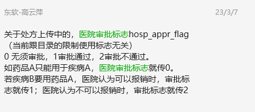
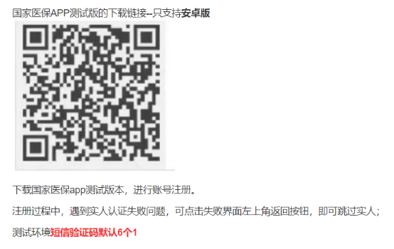

## 接口问题记录

### 目录下载接口
1.1305接口特殊:  医疗服务目录下载 现在传0或1会提示“已经是最新数据”，国家局那边目前的回复是，最大版本号用 “F001_19970101000000_C”。这个诊疗服务表是分国家和地方的，比较特殊。
第一次传F001_19970101000000_C这个就是最小的来下载，F001是国家诊疗服务信息，F002是地方。下载地方的 就改成F002。                          
2.除1305外的其他目录下载：
医疗机构首次下载版本号传 0或1；后续用获得到的版本号继续获取直到提示已是最新数据。如返回有数据则说明版本号需要继续下载。直到提示最新数据。
3.关于"本地最大版本号"的获取，在TXT文件中"版本名称"  这一列获取（版本名称都是一致的，例如西药中成药目录下载中的："X001_20210128000000_C"）；
不同版本号获取到的所有目录数据都需要保存到本地。


### 医院审批标志




## 测试环境门户

http://ipstest.yn.hsip.gov.cn


### 无卡审批

医保业务基础->个人待遇管理->个人待遇申报审批管理->待遇通用审批


### 特殊身份认定

医保业务基础->参保管理->参保人员管理->特殊身份认定


## 动态库问题记录

### 调整动态库日志为明文记录

打开 `curlcfg.json` 文件，修改 `"logtype":""`


### 测试环境电子凭证扫码

打开`CHSInterfaceYn/nationeccode.ini` 文件，修改url为测试环境解码地址，然后将此文件设置为只读


动态库1191扫码解码地址要配置测试环境的
需要修改文件 CHSInterfaceYn\nationeccode.ini
[setup]
url=http://10.114.176.150/localcfc/api/hsecfc/localQrCodeQuery
并将这个文件设置为只读，因为动态库会刷新。





### 测试工具默认配置修改

chsitest.ini

```ini
[setup]

#外网测试
#url=http://112.112.17.172:21108/eapdomain/callService
#医保内网测试
#url=http://10.114.177.55:8080/eapdomain/callService
url=http://192.168.5.212/eapdomain/callService
#医保正式地址
#url=http://ldjk.yn.hsip.gov.cn/eapdomain/callService

#fixmedins_code=H53010200310
#developerCode=democase1
#developerSign=eef17edbd8b411eb81950242ac13000d

#fixmedins_code=P53011201510
#developerCode=915101006818136552
#developerSign=neu1c16cbd194a2dbdcc690ac8aadef2

#fixmedins_code=H53018100129
#developerCode=915101006818136552
#developerSign=neubbccbf3b446d38aa63ae43a945124

fixmedins_code=H53010200310
developerCode=915101006818136552
developerSign=neu3960e50d84c1e9801dde58dbae010

[input]
1101={"infno":"1101","msgid":"20210626000000001","mdtrtarea_admvs":"530100","insuplc_admdvs":"530100","recer_sys_code":"mbs","dev_no":"","dev_safe_info":"","cainfo":"","signtype":"","infver":"1.0","opter_type":"1","opter":"test","opter_name":"test","inf_time":"2021-06-26 00:00:00","fixmedins_code":"H53010200310","fixmedins_name":"云南省第一人民医院","sign_no":"","input":{"data":{"mdtrt_cert_type":"02","mdtrt_cert_no":"530103197512152148","card_sn":"","begntime":"2021-05-26","psn_cert_type":"","certno":"","psn_name":""}}}
9101={"infno":"9101","msgid":"string","mdtrtarea_admvs":"string","insuplc_admdvs":"string","recer_sys_code":"string","dev_no":"string","dev_safe_info":"string","cainfo":"string","signtype":"string","infver":"string","opter_type":"1","opter":"string","opter_name":"string","inf_time":"2021-06-11 00:00:01","fixmedins_code":"H53010200310","fixmedins_name":"云南省第一人民医院","sign_no":"string","input":{"fsUploadIn":{"in":"","filename":"","fixmedins_code":""}}}
```

