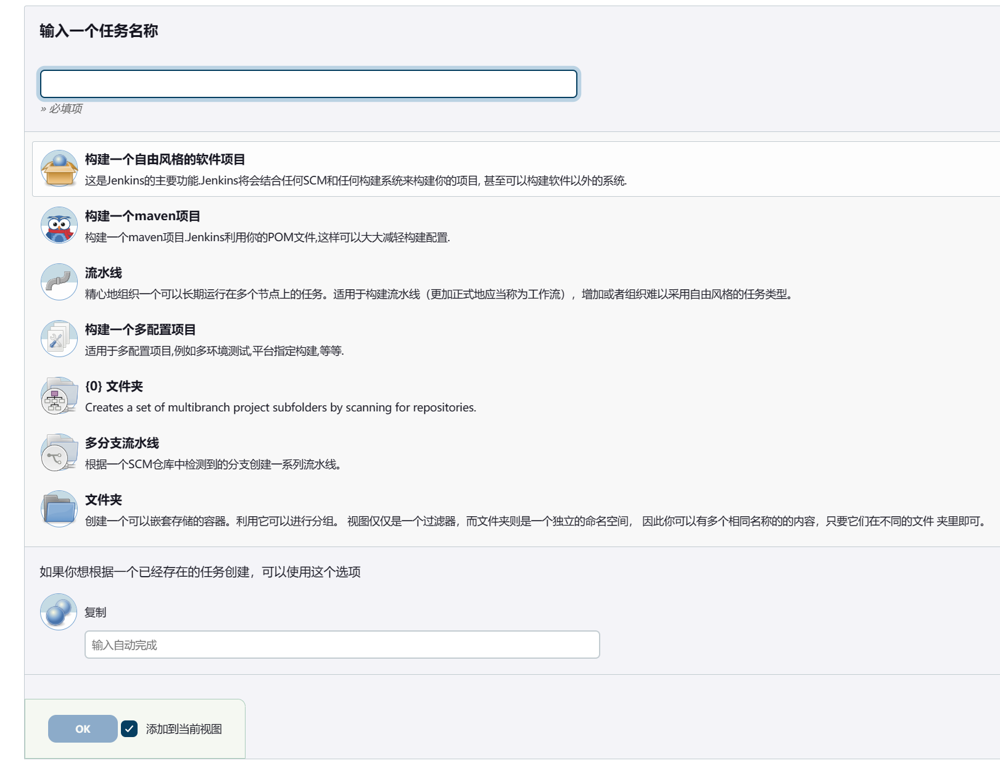
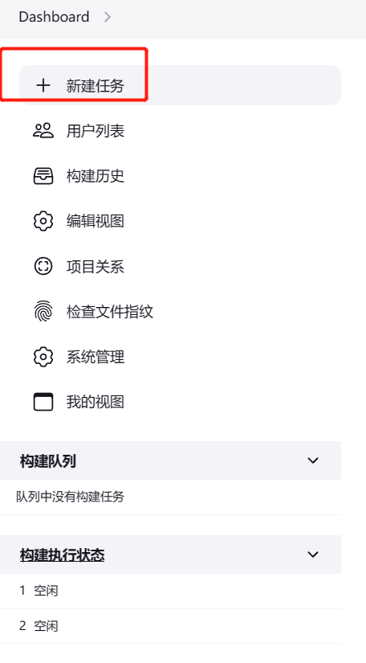
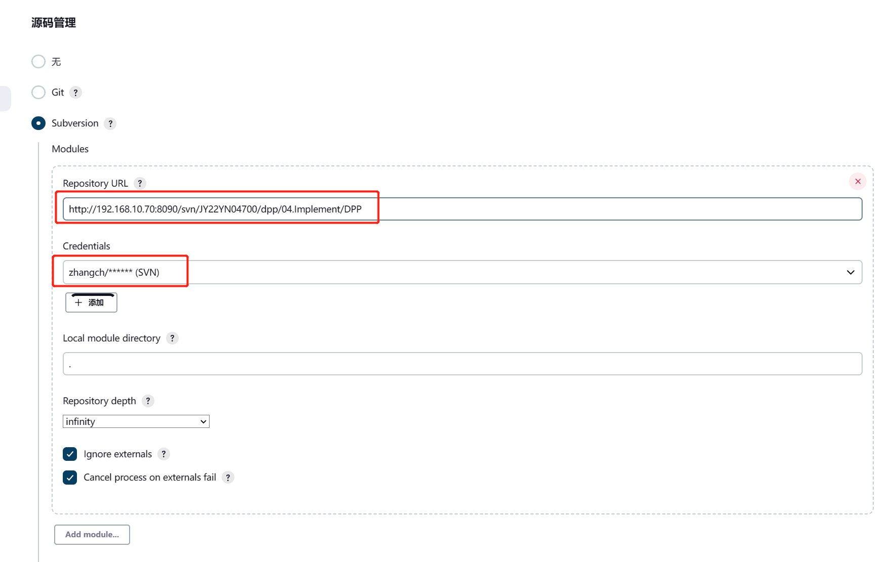
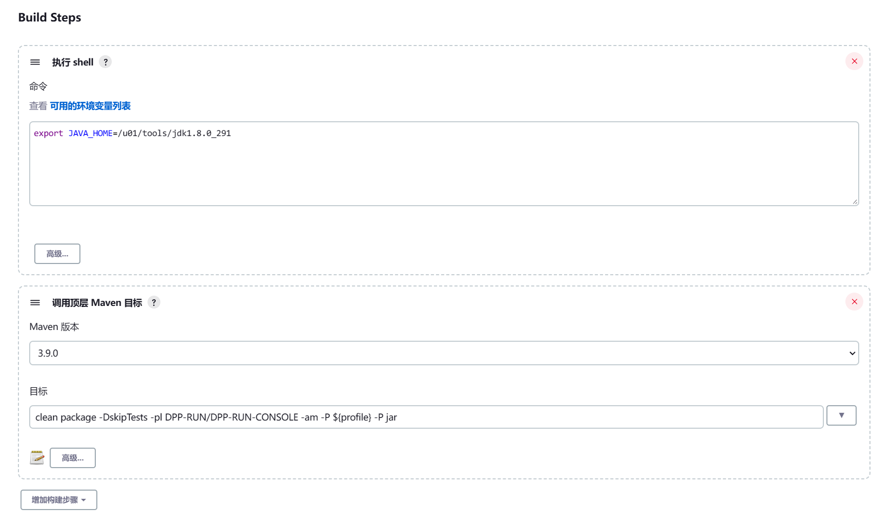
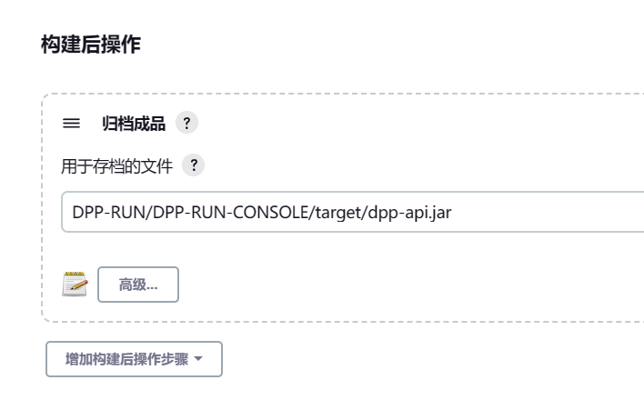
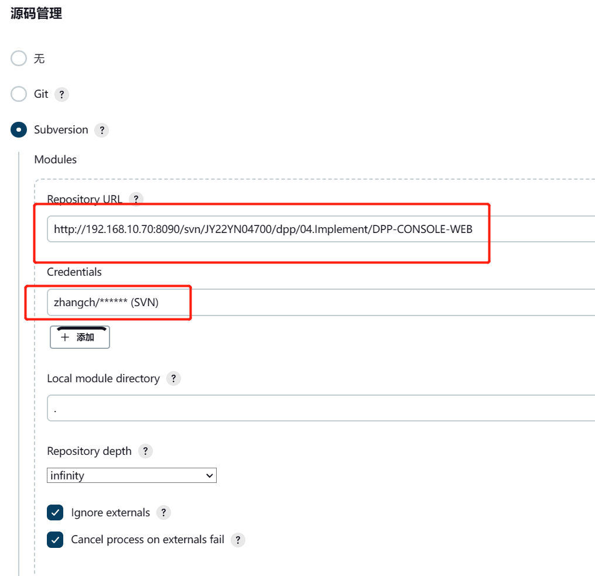
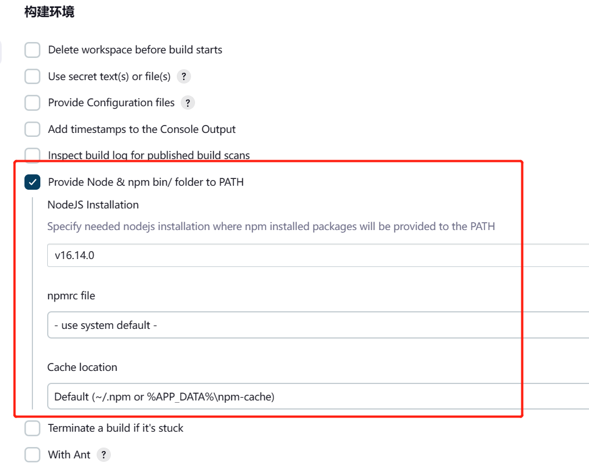
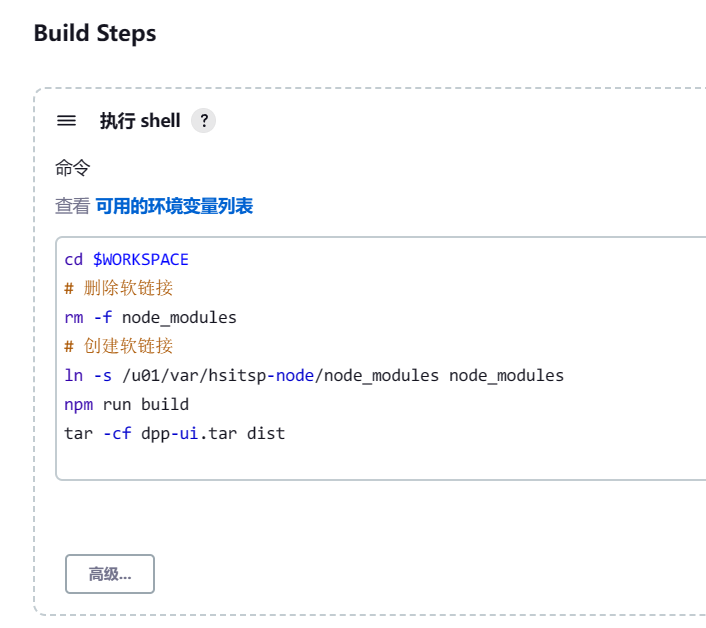
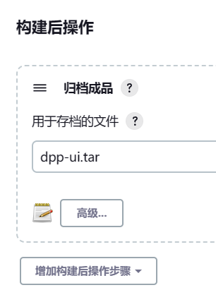

注意使用管理员账号登录 管理员账户在“Jenkins部署安装手册.md”

## 任务模板




## 新建任务



## 复制一个已存在的任务

输入被复制的任务名即可将已存在的任务作为模板复制


## Maven项目

1. 新建任务 选择 “构建一个自由风格的项目”；不要选择“构建一个maven项目”的原因，新版Jenkins本身使用JDK11编译，此时这里即使指定了JDK8编译项目，最终还是使用了JDK11编译的
2. 源码管理 指定源码仓库
3. 
4. Build Steps 注意设定JAVA环境变量
5. 
6. 构建后操作 注意选择编译完成的jar或war包
7. 归档成品
8. 


## Node项目

1. 银海云服务器不通互联网 因此npm仓库 例如淘宝仓库 https://registry.npm.taobao.org 无法使用 可以将`node_modules`目录整个复制到Jenkins服务器上。注意 `node_modules`目录应该是在Linux服务器下生成的，本机windows系统生成的无法直接使用。可以将项目根目录下的`.npmrc`文件和`package.json`复制到`192.168.5.200`服务器上执行`npm i`后将`node_modules`目录压缩后上传到Jenkins服务器

2. Jenkins服务器上`/u01/var/hsitsp-node/node_modules`是医保服务平台前端项目的node目录，理论上ta404框架前端1.5版本的都可以直接使用

3. 源码管理

4. 

5. 构建环境

6. 

7. Build Steps

   ```sh
   cd $WORKSPACE
   # 删除软链接
   rm -f node_modules 
   # 创建软链接 软链接指定的目录是第1步说明中上传到Jenkins服务器的node_modules路径
   ln -s /u01/var/hsitsp-node/node_modules node_modules
   # npm编译
   npm run build
   tar -cf dpp-ui.tar dist
   ```

   

8. 

9. 归档成品

10. 

11. Node 项目参数化构建

    ```sh
    # 参数化构建
    # 参数名称 packageType
    # 参数选项
    # tar
    # war
    # 参数选项说明
    # tar=tar压缩包
    # war=war包
    
    cd $WORKSPACE
    # 删除软链接
    rm -f node_modules 
    # 创建软链接
    ln -s /u01/var/hsitsp-node/node_modules node_modules
    # 生成SVN版本信息
    echo $SVN_REVISION > public/version.txt
    if [[ "${packageType}" = "tar" ]] ; then
        npm run build
    	tar -cf dpp-ui.tar dist
    else
        npm run build:war
    fi
    ```

    