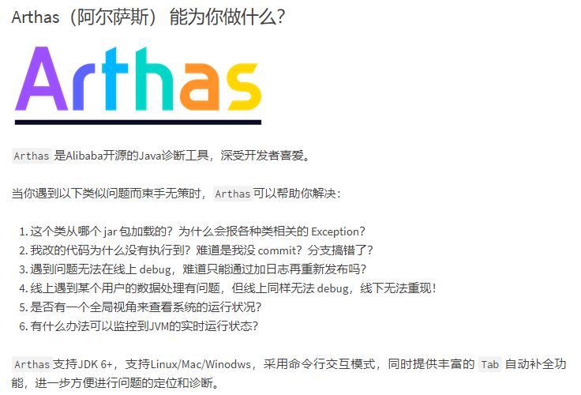
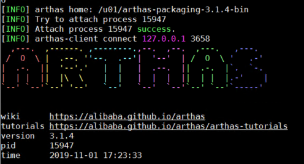

## What is Arthas



官方文档[点击此处](https://alibaba.github.io/arthas/quick-start.html )

**以下操作基于Linux服务器 注意使用监听进程启动用户登录**

## arthas安装

由于公司生产服务器通常没有公网环境 建议直接安装完整版

arthas全量安装[点击此处](https://alibaba.github.io/arthas/install-detail.html#id2 )

## 获取要监视的Java进程pid

例如 `ps -ef|grep AppServer8011`
输出中**第二列**为进程pid 即 *15947*

```powershell
weblogic 15947 15743 18 16:41 ?        00:07:29 /u01/jdk1.8.0_141/bin/java -server -Xms2560m -Xmx2560m -XX:MaxPermSize=512m -Dweblogic.threadpool.MinPoolSize=50 -cp /u01/Middleware/wlserver/server/lib/weblogic-launcher.jar -Dlaunch.use.env.classpath=true -Dweblogic.Name=AppServer8011 -Djava.awt.headless=true -Djava.security.egd=file:/dev/./urandom -Djava.security.policy=/u01/Middleware/wlserver/server/lib/weblogic.policy -Dweblogic.ProductionModeEnabled=true -Dweblogic.system.BootIdentityFile=/u01/Middleware/user_projects/domains/base_domain/servers/AppServer8011/data/nodemanager/boot.properties -Dweblogic.nodemanager.ServiceEnabled=true -Dweblogic.nmservice.RotationEnabled=true -Xms4096m -Xmx4096m -XX:-HeapDumpOnOutOfMemoryError -Djava.system.class.loader=com.oracle.classloader.weblogic.LaunchClassLoader -javaagent:/u01/Middleware/wlserver/server/lib/debugpatch-agent.jar -da -Dwls.home=/u01/Middleware/wlserver/server -Dweblogic.home=/u01/Middleware/wlserver/server -Dweblogic.management.server=http://192.168.10.45:8001 weblogic.Server
weblogic 19328 17513  0 17:23 pts/3    00:00:00 grep --color=auto AppServer8011
```

## 启动arthas

`java -jar arthas-boot.jar`

输出如下 因为要监视的进程是15947 在终端中输入 6 回车
```powershell
[INFO] arthas-boot version: 3.1.4
[INFO] Found existing java process, please choose one and hit RETURN.
* [1]: 32738 weblogic.NodeManager
  [2]: 15939 weblogic.Server
  [3]: 15955 org.apache.derby.drda.NetworkServerControl
  [4]: 28116 weblogic.Server
  [5]: 15956 weblogic.Server
  [6]: 15947 weblogic.Server
  [7]: 15934 weblogic.Server
```
出现下图 即表示对此进程监视成功



## 查看某一个类的静态变量

`getstatic ` 用于观测一个静态实例 用法如下

`getstatic 类路径 变量名`
`getstatic com.yinhai.bisp.branch.bigillnessdeductedtax.data.FileHandlerData handlerData`
输出如下
handlerData 在此示例中是一个静态Map变量 key和value都是String对象

```powershell
field: handlerData
@ConcurrentHashMap[
    @String[H4sIAAAAAAAAAEtJLUvNyS9ILdI1MjC0NDDWcQ82MLJGsI2tAStu0uAiAAAA]:@String[{"schedule":"3.00","processed":600000,"total":18096895}],
    @String[H4sIAAAAAAAAAEtJLUvNyS9ILdI1MjC0NDDWcQ82MLJGsI0hbDMQ2xCJbYTENrYGALg5xRVGAAAA\n]:@String[{"schedule":"0","processed":"0","total":42798358}],
]
Affect(row-cnt:1) cost in 56 ms.
```

## 监听指定方法的入参与出参
`watch`指令用于数据观测 观测的对象可以是方法或者一个表达式

使用示例

启动arthas后 键入以下命令 代表观测`InfoConfirmController`类的`generateSign`方法  

其中`params`-入参 `target`-目标实例 `returnObj`-出参

`watch com.yinhai.bisp.branch.bigillnessdeductedtax.controller.InfoConfirmController generateSign "{params,target,returnObj}" -x 2 -b -s -n 2`

执行结果如下 此命令观测了此方法两次 第二次输出中入参为`@String[developer],@ArrayList[isEmpty=false;size=2]` 出参是一个字符串`@String[H4sIAAAAAAAAAEtJLUvNyS9ILdI1MjC0NDDTcQ82MLRGsI2tAe3pAfAiAAAA]`

`cost=0.517657ms` 即此方法执行时花费了0.5ms

```powershell
Press Q or Ctrl+C to abort.
Affect(class-cnt:1 , method-cnt:1) cost in 338 ms.
ts=2019-11-02 16:50:45; [cost=0.517657ms] result=@ArrayList[
    @Object[][
        @String[developer],
        @ArrayList[isEmpty=false;size=2],
    ],
    @InfoConfirmController[
        logger=@Logger[Logger[com.yinhai.bisp.branch.bigillnessdeductedtax.controller.InfoConfirmController]],
        infoConfirmBranchBpo=@$Proxy422[com.yinhai.bisp.branch.bigillnessdeductedtax.bpo.impl.InfoConfirmBpoImpl@33cf103e],
        DG_NO_CONFIRM=@String[dataGridNoConfirm],
        DG_AL_CONFIRM=@String[dataGridAlConfirm],
        DT_ALL=@String[0],
        DATATYPE=@String[datatype],
    ],
    null,
]
ts=2019-11-02 16:50:45; [cost=55.929104ms] result=@ArrayList[
    @Object[][
        @String[developer],
        @ArrayList[isEmpty=false;size=2],
    ],
    @InfoConfirmController[
        logger=@Logger[Logger[com.yinhai.bisp.branch.bigillnessdeductedtax.controller.InfoConfirmController]],
        infoConfirmBranchBpo=@$Proxy422[com.yinhai.bisp.branch.bigillnessdeductedtax.bpo.impl.InfoConfirmBpoImpl@33cf103e],
        DG_NO_CONFIRM=@String[dataGridNoConfirm],
        DG_AL_CONFIRM=@String[dataGridAlConfirm],
        DT_ALL=@String[0],
        DATATYPE=@String[datatype],
    ],
    @String[H4sIAAAAAAAAAEtJLUvNyS9ILdI1MjC0NDDTcQ82MLRGsI2tAe3pAfAiAAAA],
]
Command execution times exceed limit: 2, so command will exit. You can set it with -n option.
```

## 注意事项

使用完一定要`shutdown`