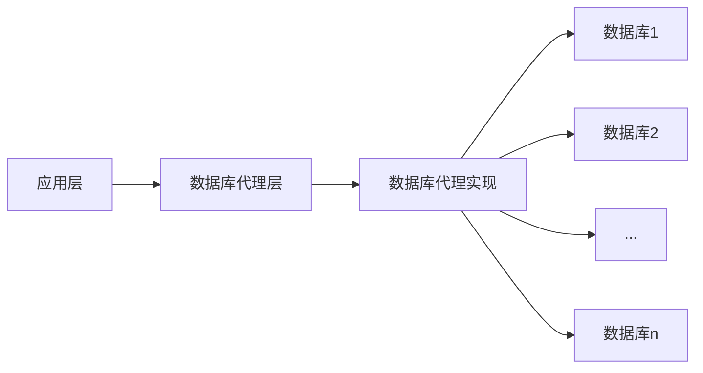

swavgfffffffffffffffffffffffffffffffffffffffffffffffffffffffffffffffffffffffffffffffffffffffffffffffffffffffffffffffffffffffffffffffffffffffffffffffffffffffffffffffffffffffffffffffffffffffffffffffffffffffffffffffffffffffffffffffffffffffffffffffffffffffffffffffffffffffffffffffffffffffffffffffffffffffffffffffffffff[TOC]

# 分库分表实践

## 应用层 访问多库

### 应用层依赖类中间件
> 与应用强耦合，需要应用显示依赖相应的jar包（以Java为例），比如知名的TDDL、当当开源的sharding-jdbc(JAVA)、蘑菇街的TSharding、携程开源的Ctrip-DAL(JAVA)

> 重新实现JDBC的API，通过重新实现DataSource、PrepareStatement等操作数据库的接口，让应用层在基本（注意：这里用了基本）不改变业务代码的情况下透明地实现分库分表的能力。

> 中间件给上层应用提供熟悉的JDBC API，内部通过sql解析、sql重写、sql路由等一系列的准备工作获取真正可执行的sql，然后底层再按照传统的方法（比如数据库连接池）获取物理连接来执行sql，最后把数据结果合并处理成ResultSet返回给应用层

在应用层面利用已有的开源框架实现分库查询  
优点 无需额外部署其他环境
缺点

### 中间层代理类中间件 数据库代理

> 这类分库分表中间件的核心原理是在应用和数据库的连接之间搭起一个代理层，上层应用以标准的MySQL协议来连接代理层，然后代理层负责转发请求到底层的MySQL物理实例，这种方式对应用只有一个要求，就是只要用MySQL协议来通信即可，所以用MySQL Workbench这种纯的客户端都可以直接连接你的分布式数据库，自然也天然支持所有的编程语言。比较有代表性的产品有开创性质的Amoeba、阿里开源的Cobar、社区发展比较好的Mycat 等

数据库代理即在应用层与实际数据库之间加一个代理 由此代理控制与实际数据库的交互

## 应用层 数据写入逻辑

### sequence
对于现有业务系统大部分表的主键都是一个由sequence生成的id  
若实现分库后 是否应该确立一个主库 所有分片库insert时均从主库取sequence

### 分库后的事务处理
如何解决?

## 数据库层 分库分表

### 垂直划分
将业务上相近且数据增长速率以及数据访问频率相近的表划分到一个数据库  
比如 将参保信息ac20-ac24 这五张表放到一个数据库
将结算信息 kc21 kc22 kc23 kc24这四张表放到一个数据库

### 水平划分
对于垂直划分依旧不能满足业务查询需求的表分到不同的库  (单个业务内数据量和并发量依旧非常庞大，则需要进一步进行水平划分 )  

比如 将 kc4g这种大表按分中心 医疗机构编号划分到若干个库
如何将kc4g分片?
#### 连续分片
上面的例子中按分中心 医疗机构编号将kc4g分片可以认为是一种连续分片,但是这种分片方式 对于分中心就诊人数较多或医院就诊人数较多的医院 来说依旧可能数据压力较大 比如说云南省第一人民医院 与 xxx社区医院 就诊量相差非常大,如果按医疗机构编号分片云南省第一人民医院所在分片数据压力仍较大

#### 随机分片
按上面连续分片举例对kc4g随机分片 例如根据时间随机分片 可以相对于连续分片做到每个分片的数据量相差不大

#### 连续与随机分片对比
> 扩容方面，连续分片更加容易扩容，当关键字增长到达某一个段的时候，添加新的分片即可，不需要进行数据迁移。而随机分片在进行扩容的时候需要进行数据迁移
> 
> 数据热度方面，连续分片很多时候存在数据热度不一致的问题，比如1年前的微博数据和现在的微博数据热度差异巨大，连续分片的情况下会导致各个库的访问压力不均匀。而随机分片，数据热度通常更加均匀。补充提一下，在随机分片中，也可能会存在超级Id，这些Id的记录远远超过其他Id，比如电商平台，可能苹果手机的访问数远超过其他商品，针对这些超级ID，通常是使用独立的分片进行特殊处理
> 
> 而对于随机分片的数据迁移问题，也有一些优化的策略。比如采用一致性哈希算法进行分片，那么每次扩容的时候，所要迁移的数据量则会大大减少。而如果数据量的上限是已知的，则还可以进一步进行优化，比如笔者做过一个业务，用户基于手机号码进行注册注销，数据量最多也是14亿，开始的时候直接划分成64个逻辑的数据库，由于前期数据量很少，这64个数据库直接使用两台物理DB提供服务，等数据量上来以后，再增加物理机器，把其中的数据库整个迁移到新的机器，避免行级别的迁移，这个过程逻辑分片数不会变