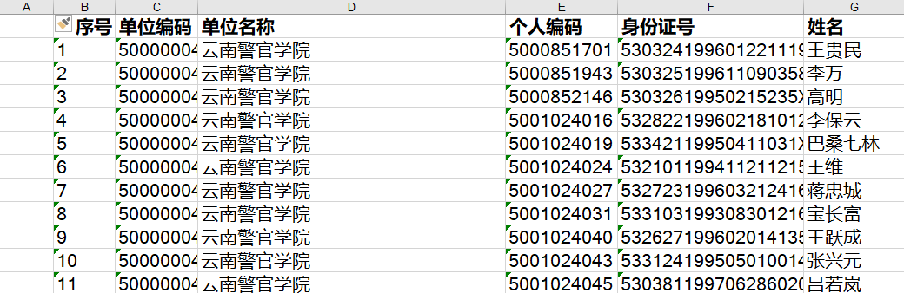
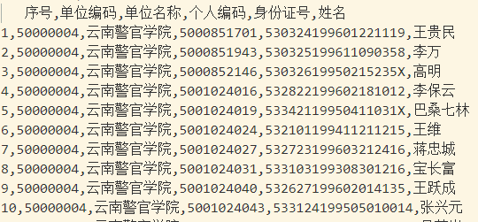
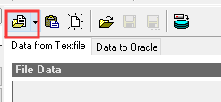
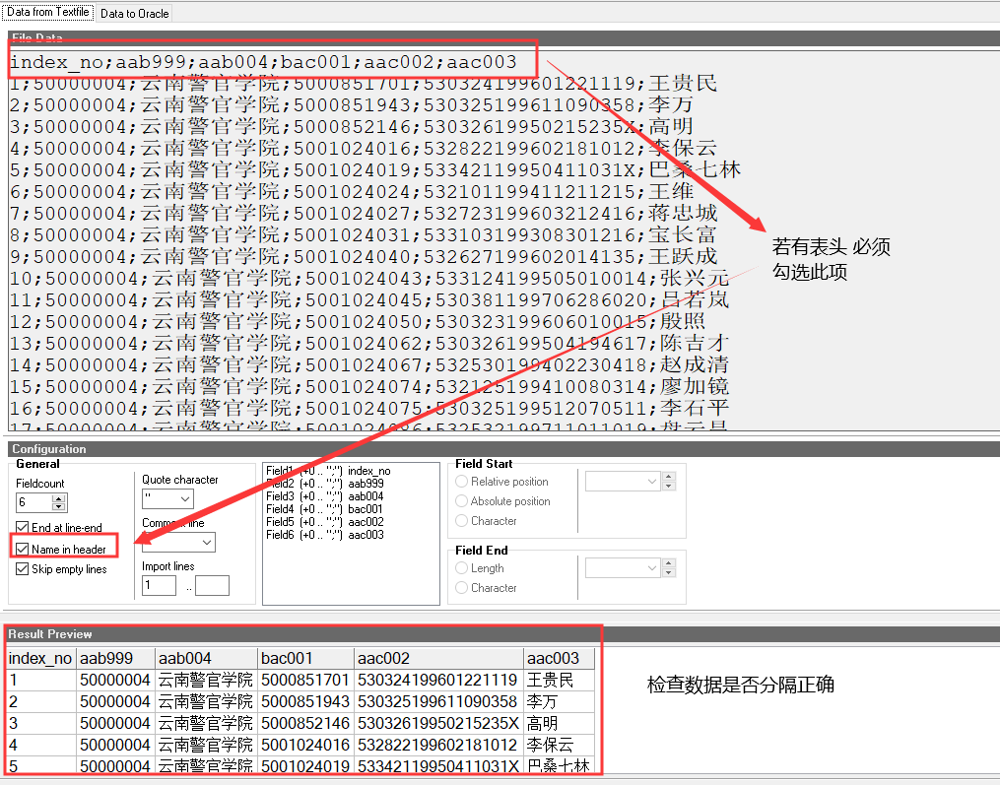
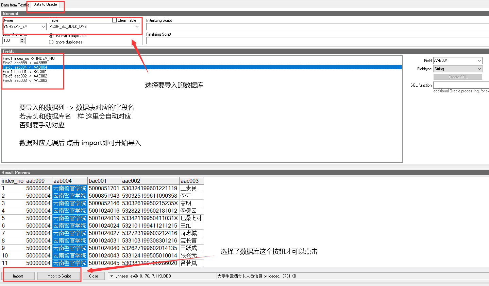

[TOC]

## 数据导入(从excel文件)
### 数据量较小 数据条数千级别及以下
示例数据 图1

例如图1的数据要导入到数据库中

1. 在最前面加入一列空列 例如下图

1. 在PL/SQL Developer中执行 `select 列名(要和excel文件的列顺序一致!) from 要导入的表名 for update`
1. 删除excel文件表头行(如果没有表头 忽略此步骤)
1. 全选excel文件所有数据 复制(ctrl+c)
1. 粘贴至步骤2的数据表编辑窗口 提交 即可

### 数据量较大 数据条数万级别

1. 将excel文件 xls或xlsx后缀的文件转为csv文件 另存为 选择csv(本就是csv后缀文件 可跳过此步)

1. 用文本编辑器(vs code/notepad++等)打开csv文件,如下图,图1的数据被转为下图的格式了
    

1. 将逗号替换为分号 将表头改为数据库的对应字段名(推荐改名 改成数据库对应字段名后 后续操作可自动将数据对应)或删除表头行 将文件后缀改为txt

1. 打开PL/SQL Developer Tools->Text Importer 点击下图红框圈中的 选择上面步骤生成的txt文件
    
    
1. 

1. 

     