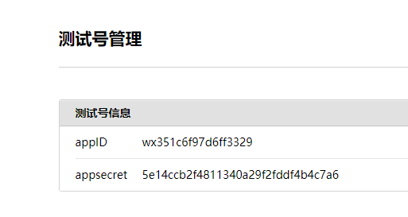
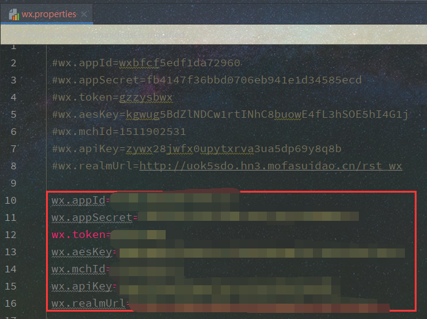
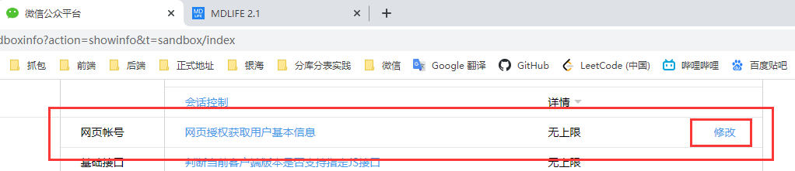

## 微信测试公众号配置过程

### 测试微信号地址
[微信测试公众号](https://mp.weixin.qq.com/debug/cgi-bin/sandbox?t=sandbox/login)

### 配置appid 及 appsecret
将微信appid及appsecret 修改为测试公众号的id

代码中修改配置 修改`wx.appid`和`wx.appSecret`为测试公众号对应值

### 配置网页url

修改代码配置中的`wx.realmUrl`为开发服务器公网映射地址

修改测试微信公众号`网页帐号`接口地址为开发服务器公网映射地址 点击下图`修改`按钮 在弹出的页面中输入开发服务器公网映射地址域名(无需http 无需端口)
例如`yinhaimed.51vip.biz`

