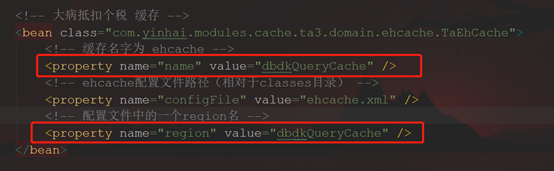
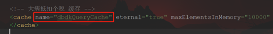
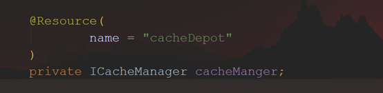
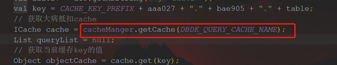
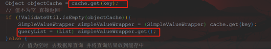
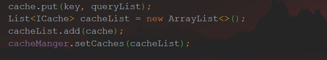
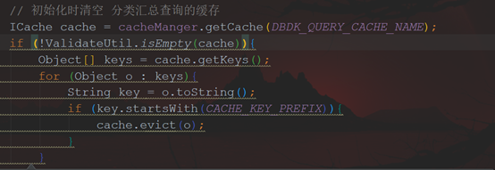
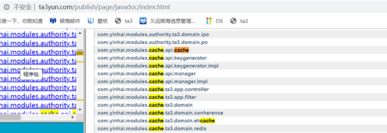

# Cache实现

## 配置文件：

spring-cache.xml 文件

增加一个bean，修改name和 region

​                               

 

ehcache.xml文件

 

 

## 代码实现（controller层）：

1、引入ICacheManger

 

 

2、获取cache 根据ehcache.xml 中配置的缓存名

 

3、根据key获取缓存值，判断是否为空，如果不为空，直接返回数据，如果为空，去数据库里面查，将结果放到缓存里面

4、页面初始化之后需清除缓存(可选)

 

备注：

API

 